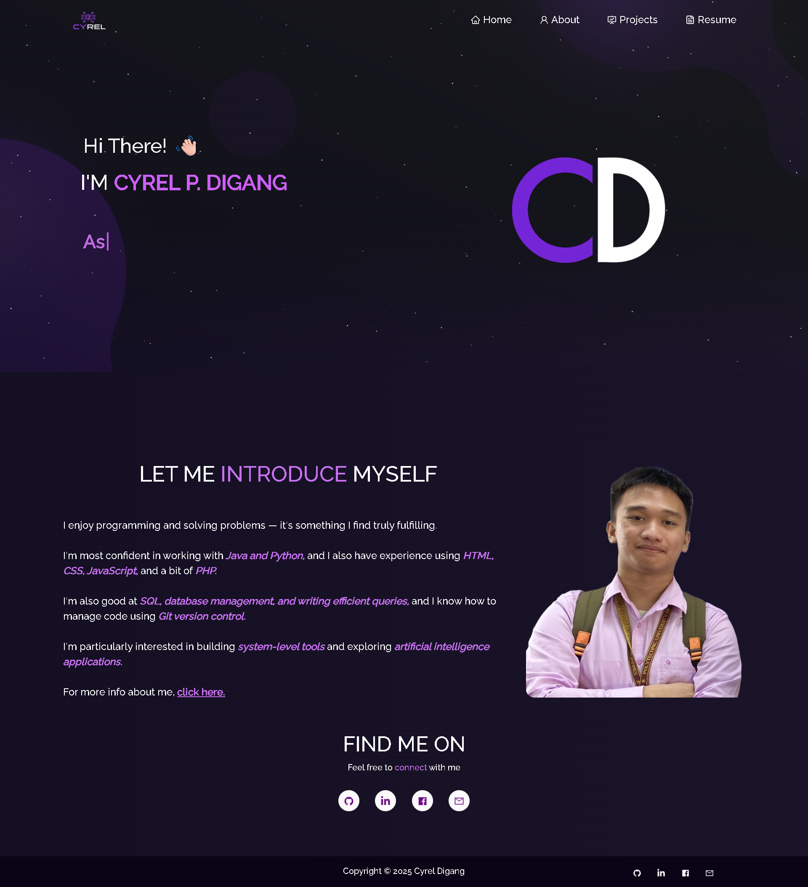

Skip to content
Chat history

You said:
can i get the code of the template i saw on figma
ChatGPT said:
To get the code of a template you saw on Figma, you have a few options — but note that Figma designs don’t directly include HTML/CSS/JS code unless the designer added it manually. Here's what you can do:

✅ If you are the owner or have access to the file:
Open the Figma file.

Inspect the design:

Click on any element.

On the right sidebar, go to the "Inspect" tab.

You’ll see automatically generated CSS code and sometimes Android/iOS styles (depending on your selection).

Manually copy styles and layout info:

Use the CSS from Inspect tab to build your HTML.

You’ll need to manually write the HTML structure and copy styles from Figma.

✅ If you want to convert Figma to code automatically:
You can use plugins or tools:

🧩 Figma Plugins:
HTML Generator

Figma to Code

Figmify

These generate code snippets for selected frames.

To use: Right-click > Plugins > Browse plugins > Install one.

🌐 External Tools:
Anima – Converts Figma to HTML/React code.

Locofy.ai – Figma to React, HTML/CSS.

Builder.io – Good for visual code generation.

✅ If it’s not your template:
You cannot extract code unless the file is public or you were granted access.

If it's a public template, you can:

Click “Duplicate” to add it to your own Figma drafts.

Then follow the steps above to inspect or export.

Would you like help building HTML/CSS code based on a Figma screenshot or shared link? If yes, feel free to upload it or share the public link.

You said:
i saw a template on a github repo and on its readme file its has instruction

Portfolio Website - v2.0
soumyajit.tech
Demo

forthebadge   forthebadge   forthebadge   GitHub Repo stars   GitHub forks

🔹 Report Bug     🔹 Request Feature
TL;DR
You can fork this repo to modify and make changes of your own. Please give me proper credit by linking back to Soumyajit4419. Thanks!

Built With
My personal portfolio soumyajit.tech which features some of my github projects as well as my resume and technical skills.

This project was built using these technologies.

React.js
Node.js
Express.js
CSS3
VsCode
Vercel
Features
📖 Multi-Page Layout

🎨 Styled with React-Bootstrap and Css with easy to customize colors

📱 Fully Responsive

Getting Started
Clone down this repository. You will need node.js and git installed globally on your machine.

🛠 Installation and Setup Instructions
Installation: npm install

In the project directory, you can run: npm start

Runs the app in the development mode.
Open http://localhost:3000 to view it in the browser. The page will reload if you make edits.

Usage Instructions
Open the project folder and Navigate to /src/components/.
You will find all the components used and you can edit your information accordingly.

Show your support
Give a ⭐ if you like this website!

Buy Me A Coffee

can you explain to me the first one, the fork, how will i do that, can i just clone his work??
ChatGPT said:
Great question, Cyrel! Let’s break it down clearly:

🔁 What does “fork this repo” mean?
To fork a repo on GitHub means to create your own copy of someone else’s repository under your GitHub account.

It’s often done when:

You want to modify someone else’s project.

You want to use it as a base for your own project.

You want to contribute back via pull requests later.

Yes, you can also just clone it, but forking gives you your own version of the project online (on GitHub), while cloning just brings it to your local machine.

✅ What should you do?
Option 1: 🔁 Forking (recommended if you want it on your own GitHub)
Go to the GitHub repo you saw.

Click the “Fork” button at the top-right.

GitHub will copy the repo under your GitHub account.

Now you have your own version. You can:

Edit it online

Clone it to your PC (git clone <your-forked-repo-url>)

Deploy it

✅ This also lets you credit the original author while customizing your version.

Option 2: 📥 Cloning directly (faster, no GitHub copy)
You can also skip the fork and run it locally:

git clone https://github.com/someone/repo-name.git
cd repo-name
npm install
npm start
However:

You don’t own it on GitHub.

If you push changes, you can’t push to the original unless you're a collaborator.

You can’t publish your version easily on GitHub unless you manually create a new repo and push.

🔁 🔄 So what’s better?
If you're:

Learning or just exploring → Cloning is okay.

Customizing for your own portfolio/project → Fork it first, then clone your fork.

If you want, I can walk you step-by-step on how to fork and run it locally. Just send the repo link!

You said:
i will do the forking, but what does the "Please give me proper credit by linking back to Soumyajit4419. Thanks!" means
ChatGPT said:
Great choice on forking, Cyrel!

The line "Please give me proper credit by linking back to Soumyajit4419. Thanks!" means:

🧑‍💻 If you use or customize the project (especially if you publish it online or share it publicly), you should acknowledge the original creator — in this case, the GitHub user Soumyajit4419.

✅ How to give proper credit
You can do any of the following (preferably a few of them):

1. Keep a line in your README
Original project by [Soumyajit4419](https://github.com/Soumyajit4419)
Or if you changed the project:

Based on the portfolio template by [Soumyajit4419](https://github.com/Soumyajit4419)
2. Keep a comment in the code
In the HTML or JS files:

// Template originally created by Soumyajit4419 on GitHub
3. Leave footer credit on your deployed site (optional)
Example:

<p>Design inspired by <a href="https://github.com/Soumyajit4419" target="_blank">Soumyajit4419</a></p>
🚫 What not to do
Don’t claim you made it from scratch.

Don’t remove all references to the original author if you're only making small changes.

Let me know if you want help adding credit to your version!

You said:
im now forking can you give me a good description
ChatGPT said:
Sure! Here's a good description you can use for your forked portfolio project — professional, clear, and gives credit:

🔹 Description for your forked GitHub repo:
A personalized portfolio website based on the original design by Soumyajit4419. This site showcases my projects, skills, and resume. Built with React.js and styled using React-Bootstrap. Fully responsive and easy to customize.

You can tweak it depending on your plans, like:

If you plan to customize it heavily:

A fully customized developer portfolio built on top of Soumyajit4419's original design. Features my own projects, resume, and tech stack.

If you plan to use it as-is with minor edits:

A forked version of Soumyajit4419's portfolio website, with slight modifications to reflect my personal projects and background.

Let me know if you want to make it sound more casual, more technical, or tailored to a specific audience (like recruiters or classmates)!

You said:
i will use the mdofication of this forked project to practice my git knowledge and also to create my own portfolio website, pls help along the process
ChatGPT said:
That's an awesome plan, Cyrel! 🚀
Forking the project to practice Git and build your own portfolio site is a smart move.

Here’s how we’ll go step-by-step — and yes, I’ll guide you all throughout!👇

✅ Step 1: Fork and Clone
You're already forking — now do this:

git clone https://github.com/<your-username>/<repo-name>.git
cd <repo-name>
npm install
npm start
📝 Let me know if any errors show up when running npm install or npm start.

✅ Step 2: Set Your Goal
Since you're using this to learn Git and build a portfolio, here’s what we’ll focus on:

🔧 Git Practice Goals:
git status, git add, git commit, git push

Branching: git checkout -b feature-name

Merging and Pull Requests (even with yourself!)

Using .gitignore, and good commit messages

🌐 Portfolio Goals:
Customize your name, bio, and social links

Add your own projects

Update styling (colors, font, maybe layout later)

Publish it on GitHub Pages or Vercel

✅ Step 3: Customize Components
In the src/components/ folder:

Start with basic edits:

Home.js – Update your name and intro

About.js – Add your background

Projects.js – Replace projects with your own

Make a Git commit each time you change something meaningful:

git add .
git commit -m "Updated About section with personal info"
git push
✅ Step 4: Publish Online
Once it's working locally and you like the look:

Use Vercel or GitHub Pages to publish it.

I’ll help you deploy when you're ready.

✅ Step 5: Keep Practicing
Create branches like:

feature/add-contact-form

feature/project-dark-theme

fix/navbar-logo

This helps simulate real-world Git workflows!

Just let me know what you’re working on at any point (like “I want to add my own project” or “I changed the colors, how do I commit?”) and I’ll walk you through it.

📌 Ready to move to Step 2 now? Or still on cloning/setup?

You said:
ty, ill start working tommorow maybe, but i just have a question, if i push my changes, where will it reflect, on my own copy of repo or the repo of the original creator
ChatGPT said:
You're welcome, Cyrel! 😄

🔁 To answer your question clearly:
If you push your changes, they will only reflect on your own forked copy of the repo — not the original creator's repo.

💡 Why?
When you fork a repo, GitHub creates a separate copy under your account.
You have full control over it — you can push, delete, and change anything.

The original repo (in this case, Soumyajit4419/portfolio) won’t be affected at all unless you:

Create a pull request to the original repo, and

The owner accepts your request (which isn’t your goal here).

🔍 Example:
You forked:

https://github.com/Soumyajit4419/portfolio
Your forked copy becomes:

https://github.com/cyrelcy/portfolio
When you push:

git push origin main
➡️ Changes go to your repo (cyrelcy/portfolio), not to Soumyajit's.

So you're safe to practice freely! Break things, try features, commit often — no risk of messing with the original project. 👍

Let me know when you're ready tomorrow, and I’ll walk with you step by step.

You said:
how about i want to make changes to the original
ChatGPT said:
Great follow-up question, Cyrel!

If you want to make changes to the original repo (the one by Soumyajit4419), here’s how it works:

🧠 You can’t push directly to the original repo unless:
The owner adds you as a collaborator, or

You submit a pull request (PR) and the owner accepts it.

✅ The Proper Way: Contribute via Pull Request
Let’s say you made useful changes (e.g. fixed a bug, improved design) and want to suggest those changes to the original repo.

Here's the process:
Fork the repo (✅ done!)

Clone your fork locally:

git clone https://github.com/cyrelcy/portfolio.git
cd portfolio
Create a new branch:

git checkout -b improve-footer
Make your changes (e.g., edit some components)

Commit your changes:

git add .
git commit -m "Improved footer section layout"
Push the branch to your fork:

git push origin improve-footer
Go to your fork on GitHub

GitHub will show a "Compare & pull request" button.

Click it to open a pull request to the original repo (Soumyajit4419/portfolio).

Submit a message describing what you changed and why.

💬 What happens next?
The original repo owner reviews your PR.

If they approve it, your changes get merged into the original project.

If not, they can ask for improvements or close it.

🚫 TL;DR: You can’t directly change the original repo — only suggest changes via a pull request.
Let me know if you want to try this process later — it’s great Git practice!

You said:
so as long i dont use the compare and pull req button, it wont change the original?
ChatGPT said:
Exactly, Cyrel — you're spot on. ✅

As long as you don’t click the “Compare & pull request” button, the original repo will never be affected.

🔒 Here’s what that means for you:
You can fork, clone, edit, commit, and push as much as you want.

All your changes will stay within your own GitHub fork (e.g., github.com/cyrelcy/portfolio).

The original repo (e.g., github.com/Soumyajit4419/portfolio) will remain unchanged unless you explicitly open a pull request and it gets accepted by the owner.

🚦You’re safe to experiment!
No need to worry — GitHub ensures you can’t accidentally change someone else’s repo. You’d have to:

Click “Compare & pull request”

Review and confirm it

Then the original author has to accept it

Let me know tomorrow when you start, and I’ll help you through customizing and using Git properly step-by-step! 😎

You said:
i already forked the repo, now its on my repo, how will i get that on my local machine
ChatGPT said:
Perfect! Now that you've forked the repo and it's under your GitHub account, here’s how to get it on your local machine:

✅ Step-by-Step: Clone Your Fork Locally
Go to your forked repo on GitHub:
👉 https://github.com/cyrelcy/portfolio (or whatever the name is)

Click the green Code button, then copy the HTTPS URL, like this:

https://github.com/cyrelcy/portfolio.git
Open your terminal or command prompt and run:

git clone https://github.com/cyrelcy/portfolio.git
Go into the project folder:

cd portfolio
🛠 Then install dependencies and run the app:
Make sure you have Node.js and npm installed. Then run:

npm install
npm start
This installs all necessary packages.

npm start will launch the React app at http://localhost:3000.

✅ Summary:
git clone https://github.com/cyrelcy/portfolio.git
cd portfolio
npm install
npm start
You're now ready to start editing the files and making commits!
Let me know once it’s running — or if you hit any issues.

You said:
PS D:\After Graduate\Cyrel Portfolio\Cyrel_Portfolio> npm install
npm : The term 'npm' is not recognized as the name of a cmdlet, function, script file, or operable program. Check the spelling of the name, or if a 
path was included, verify that the path is correct and try again.
At line:1 char:1
+ npm install
+ ~~~
    + CategoryInfo          : ObjectNotFound: (npm:String) [], CommandNotFoundException
    + FullyQualifiedErrorId : CommandNotFoundException
ChatGPT said:
Got it — that error means Node.js and npm are not installed or not added to your system’s PATH.

No worries — we can fix that quickly.

✅ Step 1: Check if Node.js is installed
Open a new terminal and type:

node -v
If it says something like command not found or 'node' is not recognized, then you need to install Node.js.

🔧 Step 2: Install Node.js (includes npm)
Go to: https://nodejs.org

Download the LTS version (Recommended for most users)

Run the installer:

✅ Keep everything default

✅ Make sure “Add to PATH” is checked during installation

After installing, restart your terminal and type:

node -v
npm -v
You should now see versions like:

v18.17.1
9.6.7
✅ Step 3: Try again
Once Node.js and npm are installed, go back to your project folder:

cd "D:\After Graduate\Cyrel Portfolio\Cyrel_Portfolio"
npm install
npm start
Let me know once you’ve installed Node.js or if you want me to check the download link for your Windows version!

You said:
how  to restart terminal
ChatGPT said:
Good question! Restarting the terminal just means closing it and opening it again to refresh the environment.

Here’s how depending on what you're using:

🪟 If you're using PowerShell or Command Prompt:
❌ Close the terminal window (click the X or type exit and press Enter)

🟢 Open it again:

Press Win + S and search for "PowerShell" or "Command Prompt"

Click to open

🧰 If you're using VS Code Terminal:
In VS Code, press:

Ctrl + `
(This opens or focuses the terminal)

To restart:

Click the trash icon 🗑️ in the terminal panel to kill the session

Then click the "+" (plus) button to open a new terminal

🧼 Tip: Why restart?
After installing something like Node.js, restarting ensures the system path gets refreshed, so commands like node and npm start working.

Let me know if it works after restart or if you're using a different terminal (like Git Bash or Windows Terminal)!

You said:
is npm install normally takes time??
ChatGPT said:
Yes, Cyrel — npm install can take some time, especially the first time you run it on a project. That's completely normal. ⏳

⏱️ How long is normal?
Small/simple projects: 10–30 seconds

React projects with many dependencies (like yours): 1–3 minutes

Slower internet or first-time setup: can go up to 5 minutes or more

💡 What's happening during npm install?
It reads your package.json file

Downloads all the required libraries (dependencies) from the npm registry

Stores them in the node_modules/ folder

Creates or updates the package-lock.json file

🔍 What to look for:
If you see lots of lines scrolling, that’s normal — npm is downloading packages.

If it's stuck for 5+ minutes with no new output, or if there's an error message, something might be wrong (I can help troubleshoot it).

Let it run for a bit, and if you're unsure whether it's still working or stuck, just copy and paste the output here — I’ll take a look!

You said:
PS D:\After Graduate\Cyrel Portfolio\Cyrel_Portfolio> npm start

> portfolio@0.1.0 start
> react-scripts start

is this ok now??
ChatGPT said:
Yes, Cyrel — that's a very good sign! ✅

This line:

> portfolio@0.1.0 start
> react-scripts start
means npm start is successfully launching the React development server. 🎉

What happens next:
You should see more lines like:

Compiled successfully!

You can now view portfolio in the browser.

Local:            http://localhost:3000
👉 Check your browser:
Open your browser and go to:

http://localhost:3000
You should now see the portfolio website running locally on your machine!

Let me know if:

It’s showing up on the browser ✅

You see any errors ❌

Or you’re ready to move on to editing your own content! 🛠️

You said:
i did a bit of change in a js file just to experience working on git now, how to add that file before commit
ChatGPT said:
Nice move, Cyrel! 👏 You're on the right track.

To add your changed file before committing it, follow these steps in the terminal (inside your project folder):

✅ Step 1: Check what changed
git status
This will show which files you’ve modified (should appear in red or under “modified”).

✅ Step 2: Add the file
You have a couple of options:

👉 If you want to add just one file:
git add src/components/YourFileName.js
(replace the path with the actual file you edited)

👉 If you're okay adding all changed files:
git add .
This stages all modified or new files in the folder.

✅ Step 3: Commit your change
git commit -m "Updated [filename] with minor changes for testing"
Write a message that clearly explains what the change was (even if it's just a test, it's good habit).

✅ Step 4: Push to GitHub
git push origin main
(if you’re working on a branch other than main, replace main with your branch name)

Let me know what file you edited if you want help with the git add path, or if you want to try branching next!

You said:
after i do npm start on terminal, i can go back to the line where i can type commands for git
ChatGPT said:
Great question, Cyrel!

When you run:

npm start
The terminal is occupied running the React dev server, so you can’t type Git commands in that same terminal until you stop the server or open a new terminal window.

🔄 You have two options:
✅ Option 1: Open a new terminal window/tab
If you're using VS Code:

Press Ctrl + Shift + ' to open a new terminal tab.

Or click the ➕ icon in the terminal panel.

If you're using PowerShell/Command Prompt:

Just open another window.

Now in the new terminal, navigate back to your project folder:

cd "D:\After Graduate\Cyrel Portfolio\Cyrel_Portfolio"
And you can run your Git commands there.

✅ Option 2: Stop the server temporarily
In your current terminal (the one running npm start), press:

Ctrl + C
This will stop the React server so you can use the terminal again.
Then run your Git commands like:

git add .
git commit -m "Made changes"
git push
When you're done, just start the server again:

npm start
Let me know which option you prefer, or if you want to try committing your changes now!

You said:
i just add another terminal, didnt know its possible ty
ChatGPT said:
Nice! 🙌 Yup — adding another terminal is super useful, especially when you're working on a project that runs a server and needs Git commands at the same time.

You're officially working like a real developer now. 😎💻

If you ever need to:

test something while coding,

commit while the app is running,

or run multiple scripts…

Multiple terminals are your best friend.

Let me know when you're ready to commit and push, or if you want to try branching or editing your portfolio next!

You said:
i already do a push, why its now reflecting on the calendar contribution
ChatGPT said:
Great job on pushing, Cyrel! 💪
If your GitHub contribution graph (calendar) isn’t showing your recent push, there are a few common reasons — and I’ll walk you through how to fix it.

🔍 Common Reasons It's Not Showing:
✅ 1. You're not pushing to the default branch (usually main)
GitHub only shows contributions to the default branch of a repo.

To check the default branch of your fork:

Go to your repo on GitHub.

Click Settings > Branches.

See if main is the default branch.

➡️ If you're pushing to a different branch (like test or feature-x), it won’t show on your calendar until it’s merged to main.

✅ 2. Your GitHub email doesn’t match your local Git config
This is the most common issue.

To check your Git config, run this in your terminal:

git config user.email
Then compare it with your GitHub account email (go to GitHub > Settings > Emails).

🔧 If they don’t match, GitHub won’t recognize the commit as yours!

🛠️ Fix it (if needed):
git config --global user.email "your-email@example.com"
Make sure to use the same email that’s connected to your GitHub account (even if it’s private — GitHub still tracks it).

✅ 3. Your forked repo is not public
GitHub doesn’t show contributions from private repos on your public profile calendar unless you enable that.

🔧 To show private contributions:
Go to https://github.com/settings/profile → Check:

✅ Include private contributions on my profile
✅ 4. It takes a few minutes to update
Sometimes it takes GitHub a couple of minutes to refresh the contribution graph.

💡 How to check if your commit was counted
Go to your GitHub profile, click "Contributions" > "View all activity", and scroll down.

If your commit shows up there, you’re good — the green box will follow shortly.

Let me know what git config user.email shows, or send me the GitHub link to your fork if you want me to double-check!

You said:
how to add branch, switch to that branch
ChatGPT said:
Nice! Creating and switching to branches is a core part of working with Git like a pro — and it's super useful for testing, experimenting, or working on features safely.

✅ To create a branch and switch to it:
In one command:
git checkout -b new-branch-name
✅ This:

creates a branch called new-branch-name

switches to it immediately

🔁 Example:

git checkout -b feature-add-contact-section
🧭 To switch between existing branches:
git checkout main
or

git checkout feature-add-contact-section
🧪 To view all branches:
git branch
The one with the * is your current branch

It lists local branches only (not remote ones unless fetched)

📤 To push your branch to GitHub (if you want it online):
git push origin feature-add-contact-section
Then you’ll see the new branch appear on your GitHub repo under the "branches" tab.

Let me know if you want help merging branches, or making a pull request from one branch to another!

You said:
lets do it step by step, adding of branch first
ChatGPT said:
Perfect, Cyrel — let's take it step by step. 👌
We’ll start with creating a new branch.

✅ Step 1: Open your terminal
Make sure you're inside your project folder (Cyrel_Portfolio).

You can verify with:

pwd  # for Mac/Linux
or

cd   # for Windows, should show the current path
✅ Step 2: Create a new branch and switch to it
Now run:

git checkout -b my-first-branch
You can replace my-first-branch with any name like:

feature-update-about

experiment-navbar

dark-mode-test

🧠 What this does:
Creates a new branch based on your current branch (usually main)

Switches to that new branch immediately

✅ Step 3: Confirm you're on the new branch
Run:

git branch
You should see something like:

* my-first-branch
  main
The * means you're now working inside my-first-branch.

Let me know once you’ve done this or if anything shows up differently! We’ll go to the next step after.

You said:
now im in my new branch, is the new branch already have whats inside my master branch?
ChatGPT said:
Yes — exactly! ✅

When you create a new branch using:

git checkout -b my-first-branch
It is created from whatever branch you were on before — in your case, most likely main (or master if your project uses that name).

🔄 So your new branch is a copy of the current state of main
All the files

All the folders

All the code

Are exactly the same at the moment the branch was created

From here on:

Any changes you make in my-first-branch won’t affect main

And vice versa — unless you merge them later

You're ready to:

Modify code

Commit changes

Test features safely

Let me know if you want to make a test change and commit it next! 🛠️

You said:
 i think there is a way on creating a branch without immedietly switching on it
ChatGPT said:
You're absolutely right, Cyrel! 👍

You can create a branch without switching to it immediately using this command:

✅ To create a branch but stay on the current branch:
git branch branch-name
🔁 Example:

git branch testing-branch
This just creates the branch.

🔍 To confirm it was created:
git branch
You’ll see a list like:

* current-branch
  testing-branch
The * shows your current branch. The new branch is created but you’re still on the old one.

🔄 To switch to that branch later:
git checkout testing-branch
OR (in newer versions of Git):

git switch testing-branch
So to recap:

Task	Command
Create & switch	git checkout -b branch-name
Create only	git branch branch-name
Switch to existing	git checkout branch-name or git switch branch-name
Let me know if you want to continue with modifying something in your new branch and committing next!

You said:
how do i go back on main
ChatGPT said:
Great question, Cyrel!

To go back to the main branch (or master, depending on your repo), just run:

git checkout main
or if you're using a newer version of Git:

git switch main
🔍 To confirm:
Run:

git branch
You’ll see:

* main
  my-first-branch
The * means you’re now on the main branch.

Let me know if you want to merge changes from your branch into main next, or continue working separately!

You said:
now i want to delete the branch i created
ChatGPT said:
No problem, Cyrel! You can delete a Git branch easily — just make sure you're not currently on that branch when you try to delete it.

✅ Step 1: Make sure you're not on the branch you want to delete
You've already switched back to main, so you're good.

✅ Step 2: Delete the branch
🔹 To delete a local branch:
git branch -d branch-name
🔁 Example:

git branch -d my-first-branch
🧠 What’s the difference between -d and -D?
-d = safe delete: only deletes if the branch has been fully merged

-D = force delete: deletes the branch even if it hasn’t been merged

Use -D if you’re just experimenting or sure you don’t need the changes.

git branch -D my-first-branch
Let me know if the branch is giving you a warning, and I’ll guide you through it!

You said:
what will happen if i didnt delete the terminal that run sa node.js, is the project still run after i close my ide?
ChatGPT said:
Great question, Cyrel! 👇

❓What happens if you don’t stop the terminal running npm start and just close your IDE?
➤ If you close your IDE or terminal without stopping npm start:
The development server (React app) will automatically stop running.

Your local site at http://localhost:3000 will no longer work until you restart it.

✅ No damage is done — it just stops the dev server. You can always start it again later with:

npm start
🔁 Summary:
Action	Will the project keep running?
Close terminal running npm start	❌ No — server stops
Close VS Code or IDE	❌ No — server stops
Leave terminal open	✅ Yes — server keeps running
Reopen terminal later	✅ Can restart with npm start
So don’t worry — closing the terminal or IDE won’t break anything. You’ll just need to rerun npm start next time you want to preview your site again.

Let me know if you want a shortcut to restart everything when you return!

You said:
what is sync fork
ChatGPT said:
Great question, Cyrel!

🔄 What is "Sync Fork"?
When you fork a repository, you're creating a copy of the original repo under your GitHub account.

Over time, the original repo may get updates — like new features, fixes, or improvements — but your fork won’t automatically update.
That's where syncing your fork comes in.

🧠 In short:
Syncing a fork means updating your forked repo so it matches the latest changes from the original (upstream) repository.

✅ Why you might sync your fork:
The original repo has new commits you want

You want to stay updated before working on new features

You want to avoid conflicts later when making pull requests

🔧 How to sync your fork (step-by-step):
Assuming you're working locally and already cloned your fork:

✅ Step 1: Add the original repo as a remote
This tells Git where the original repo is.

git remote add upstream https://github.com/OriginalAuthor/original-repo.git
(Replace the URL with the original repo's URL)

✅ Step 2: Fetch the latest changes from the original (upstream)
git fetch upstream
✅ Step 3: Merge the changes into your local main branch
Make sure you’re on your main branch:

git checkout main
Then merge:

git merge upstream/main
✅ Step 4: Push the updated main to your GitHub fork
git push origin main
🧼 Now your fork is in sync!
Let me know if you want to try syncing your fork now — I’ll walk you through it using your actual URLs if you want!

You said:
          <Col md={8} className="home-about-description">
            <h1 style={{ fontSize: "2.6em" }}>
              LET ME <span className="purple"> INTRODUCE </span> MYSELF
            </h1>
            <p className="home-about-body">
              I fell in love with programming and I have at least learnt
              something, I think… 🤷‍♂️
              <br />
              <br />I am fluent in classics like
              <i>
                <b className="purple"> C++, Javascript and Go. </b>
              </i>
              <br />
              <br />
              My field of Interest's are building new &nbsp;
              <i>
                <b className="purple">Web Technologies and Products </b> and
                also in areas related to{" "}
                <b className="purple">
                  Blockchain.
                </b>
              </i>
              <br />
              <br />
              Whenever possible, I also apply my passion for developing products
              with <b className="purple">Node.js</b> and
              <i>
                <b className="purple">
                  {" "}
                  Modern Javascript Library and Frameworks
                </b>
              </i>
              &nbsp; like
              <i>
                <b className="purple"> React.js and Next.js</b>
              </i>
            </p>
          </Col>


lets edit this part of the code
i dont really know what to put here, but ill just give you some facts about me:
i enjoy programmin, solving problems, its fullfiling
im good at java and python, and has a bit of experience with html, css javascript and php
im intesrested in build systems and ai system
then add, for more info about me, click the about(link) 
ChatGPT said:
Sure, Cyrel! Here's a personalized and polished version of your code based on the facts you shared:

✅ Updated JSX Code:
<Col md={8} className="home-about-description">
  <h1 style={{ fontSize: "2.6em" }}>
    LET ME <span className="purple"> INTRODUCE </span> MYSELF
  </h1>
  <p className="home-about-body">
    I enjoy programming and solving problems — it's something I find truly fulfilling.
    <br />
    <br />
    I'm most confident in working with
    <i>
      <b className="purple"> Java and Python,</b>
    </i>
    &nbsp;and I also have experience using
    <i>
      <b className="purple"> HTML, CSS, JavaScript,</b>
    </i>
    &nbsp;and a bit of
    <i>
      <b className="purple"> PHP.</b>
    </i>
    <br />
    <br />
    I'm particularly interested in building
    <i>
      <b className="purple"> system-level tools</b>
    </i>
    &nbsp;and exploring
    <i>
      <b className="purple"> artificial intelligence applications.</b>
    </i>
    <br />
    <br />
    For more info about me, <a href="#about" className="purple"><b>click here.</b></a>
  </p>
</Col>
📌 Notes:
The link uses #about — this assumes the "About" section has an anchor ID or routing path to link to.

You can change href="#about" to something else depending on your routing setup.

Let me know if you want to add more sections or adjust the tone (e.g., more casual or more technical).

You said:
 <li className="social-icons">
                <a
                  href="https://www.facebook.com/cyrel.digang.27/"
                  target="_blank"
                  rel="noreferrer"
                  className="icon-colour home-social-icons"
                >
                  <AiFillInstagram />
                </a>
              </li>

how to change this to fb logo
ChatGPT said:
Great eye, Cyrel! 👀 You're using the AiFillInstagram icon from the react-icons library — so to change it to a Facebook icon, you'll just need to:

✅ Step 1: Import the Facebook icon
At the top of the file (where other icons like AiFillInstagram are imported), add:

import { AiFillFacebook } from "react-icons/ai";
✅ Step 2: Replace the icon in the JSX
Change this line:

<AiFillInstagram />
To this:

<AiFillFacebook />
✅ Final JSX:
<li className="social-icons">
  <a
    href="https://www.facebook.com/cyrel.digang.27/"
    target="_blank"
    rel="noreferrer"
    className="icon-colour home-social-icons"
  >
    <AiFillFacebook />
  </a>
</li>
Let me know if you want to add GitHub, LinkedIn, or any others — I can give you the right icon names and import statements too!

You said:
how about gmail
ChatGPT said:
Good question, Cyrel!

📧 Gmail doesn’t have a direct icon (like Facebook or Instagram) in react-icons, but there are good alternatives you can use to represent email.
Here are two solid options:

✅ Option 1: Use AiOutlineMail (from react-icons/ai)
🔹 Step 1: Import it
import { AiOutlineMail } from "react-icons/ai";
🔹 Step 2: Add to your JSX
<li className="social-icons">
  <a
    href="mailto:yourname@gmail.com"
    target="_blank"
    rel="noreferrer"
    className="icon-colour home-social-icons"
  >
    <AiOutlineMail />
  </a>
</li>
📬 mailto: will open the user's default mail app to send you an email.

✅ Option 2: Use SiGmail (from react-icons/si) — Gmail logo style
🔹 Step 1: Import it
import { SiGmail } from "react-icons/si";
🔹 Step 2: Use in JSX
<li className="social-icons">
  <a
    href="mailto:yourname@gmail.com"
    target="_blank"
    rel="noreferrer"
    className="icon-colour home-social-icons"
  >
    <SiGmail />
  </a>
</li>
This one looks more like the Gmail icon — more visual.

Let me know your preferred style, and I can help you adjust the size, color, or tooltip too!

You said:
the mailto dont work
ChatGPT said:
Got it, Cyrel! Let’s make sure the mailto: is working correctly. Here’s a checklist to fix it:

✅ Correct Setup for mailto:
Here's a working example you can copy and update with your actual email:

<li className="social-icons">
  <a
    href="mailto:cyreldegang@example.com"
    className="icon-colour home-social-icons"
  >
    <AiOutlineMail />
  </a>
</li>
⚠️ Make sure to replace cyreldegang@example.com with your actual email (no spaces, no extra characters).

⚠️ Common Issues to Check
No mailto: text?

Must start exactly like this:
href="mailto:your.email@gmail.com"

Wrong quote marks?

Must use regular " double quotes, not smart quotes (“ ”) or single quotes.

Are you testing in the browser?

mailto: only works when you click it in a browser, not in a preview like mobile emulators or some dev tools.

Default mail client not set up?

If clicking the link does nothing, your system might not have a mail app (like Outlook or Mail) configured.

Try right-clicking it > "Copy Email Address" — if that works, your link is fine.

🔧 Extra: Open Gmail in browser instead (optional)
If you want to force it to open Gmail in a new tab:

<a
  href="https://mail.google.com/mail/?view=cm&fs=1&to=cyreldegang@gmail.com"
  target="_blank"
  rel="noreferrer"
  className="icon-colour home-social-icons"
>
  <SiGmail />
</a>
✅ This opens Gmail with a new message window to your address.

Let me know which version you want to keep — mailto: or open-Gmail — and I’ll help you polish it further!

You said:
it actually work but, the user should choose to open it on a mail app, i want it to open gmail
ChatGPT said:
Ah, perfect — thanks for clarifying, Cyrel! 👍
You're right: mailto: opens the user's default mail app, which might not be Gmail.

If you want it to always open Gmail in a browser with a new message ready to send, here’s how:

✅ Use a Gmail Compose Link Instead of mailto:
Replace your <a> tag with this format:

<a
  href="https://mail.google.com/mail/?view=cm&fs=1&to=cyreldegang@gmail.com"
  target="_blank"
  rel="noreferrer"
  className="icon-colour home-social-icons"
>
  <SiGmail />
</a>
✅ This will:

Open Gmail in a new browser tab

Automatically fill in the "To:" field with your email

📌 Bonus: Want to pre-fill the subject and body?
You can add parameters like:

https://mail.google.com/mail/?view=cm&fs=1&to=cyreldegang@gmail.com&su=Hello%20Cyrel&body=I'm%20interested%20in%20your%20work!
Use %20 for spaces.

Let me know if you want to include a pre-filled subject or body — I can format it for you!

You said:
yeah it works, nice
ChatGPT said:
Awesome! 😄 Glad it worked, Cyrel — now your Gmail link behaves exactly the way you wanted.
Clean, direct, and user-friendly. ✅

If you’re planning to customize other sections of your portfolio (like the About, Projects, or Skills), or want help with deploying it later — just ping me. 🚀

You’re doing great!

You said:
import React from "react";
import { Container, Row, Col } from "react-bootstrap";
import myImg from "../../Assets/avatar.svg";
import Tilt from "react-parallax-tilt";
import {
  AiFillGithub,
  AiFillInstagram,
  AiFillFacebook,
  AiOutlineMail
} from "react-icons/ai";
import { FaLinkedinIn } from "react-icons/fa";

function Home2() {
  return (
    <Container fluid className="home-about-section" id="about">
      <Container>
        <Row>
          <Col md={8} className="home-about-description">
            <h1 style={{ fontSize: "2.6em" }}>
              LET ME <span className="purple"> INTRODUCE </span> MYSELF
            </h1>
            <p className="home-about-body">
              I enjoy programming and solving problems — it's something I find truly fulfilling.
              <br />
              <br />
              I'm most confident in working with
              <i>
                <b className="purple"> Java and Python,</b>
              </i>
              &nbsp;and I also have experience using
              <i>
                <b className="purple"> HTML, CSS, JavaScript,</b>
              </i>
              &nbsp;and a bit of
              <i>
                <b className="purple"> PHP.</b>
              </i>
              <br />
              <br />
              I'm particularly interested in building
              <i>
                <b className="purple"> system-level tools</b>
              </i>
              &nbsp;and exploring
              <i>
                <b className="purple"> artificial intelligence applications.</b>
              </i>
              <br />
              <br />
              For more info about me, <a href="#about" className="purple"><b>click here.</b></a>
            </p>
          </Col>

          <Col md={4} className="myAvtar">
            <Tilt>
              
            </Tilt>
          </Col>
        </Row>
        <Row>
          <Col md={12} className="home-about-social">
            <h1>FIND ME ON</h1>
            <p>
              Feel free to <span className="purple">connect </span>with me
            </p>
            <ul className="home-about-social-links">
              <li className="social-icons">
                <a
                  href="https://github.com/CyrelDigang"
                  target="_blank"
                  rel="noreferrer"
                  className="icon-colour  home-social-icons"
                >
                  <AiFillGithub />
                </a>
              </li>
              <li className="social-icons">
                <a
                  href="www.linkedin.com/in/cyrel-digang-990b5b2bb"
                  target="_blank"
                  rel="noreferrer"
                  className="icon-colour  home-social-icons"
                >
                  <FaLinkedinIn />
                </a>
              </li>
              <li className="social-icons">
                <a
                  href="https://www.facebook.com/cyrel.digang.27/"
                  target="_blank"
                  rel="noreferrer"
                  className="icon-colour home-social-icons"
                >
                  <AiFillFacebook />
                </a>
              </li>
              <li className="social-icons">
                <a
                  href="https://mail.google.com/mail/?view=cm&fs=1&to=digangc@gmail.com"
                  target="_blank"
                  rel="noreferrer"
                  className="icon-colour home-social-icons"
                >
                  <AiOutlineMail />
                </a>
              </li>
            </ul>
          </Col>
        </Row>
      </Container>
    </Container>
  );
}
export default Home2;


why when i clicked the linked in it just open a new tab of the portfolio, not the llinked in 
ChatGPT said:
Good catch, Cyrel! 🔎
The issue is with the LinkedIn URL — it's missing the protocol (https://).
When a URL doesn’t start with http:// or https://, the browser treats it as a relative path and tries to open it within your portfolio site, which is why it just opens a new tab of your site.

✅ Fix: Add https:// to the LinkedIn link
Update this:

href="www.linkedin.com/in/cyrel-digang-990b5b2bb"
To this:

href="https://www.linkedin.com/in/cyrel-digang-990b5b2bb"
✅ Final code for LinkedIn icon:
<li className="social-icons">
  <a
    href="https://www.linkedin.com/in/cyrel-digang-990b5b2bb"
    target="_blank"
    rel="noreferrer"
    className="icon-colour home-social-icons"
  >
    <FaLinkedinIn />
  </a>
</li>
Now clicking it should open your actual LinkedIn profile in a new tab. 🚀

Let me know if you want to add tooltips or hover effects next!

You said:
<Col md={8} className="home-about-description">
            <h1 style={{ fontSize: "2.6em" }}>
              LET ME <span className="purple"> INTRODUCE </span> MYSELF
            </h1>
            <p className="home-about-body">
              I enjoy programming and solving problems — it's something I find truly fulfilling.
              <br />
              <br />
              I'm most confident in working with
              <i>
                <b className="purple"> Java and Python,</b>
              </i>
              &nbsp;and I also have experience using
              <i>
                <b className="purple"> HTML, CSS, JavaScript,</b>
              </i>
              &nbsp;and a bit of
              <i>
                <b className="purple"> PHP.</b>
              </i>
              <br />
              <br />
              I'm particularly interested in building
              <i>
                <b className="purple"> system-level tools</b>
              </i>
              &nbsp;and exploring
              <i>
                <b className="purple"> artificial intelligence applications.</b>
              </i>
              <br />
              <br />
              For more info about me, <a href="#about" className="purple"><b>click here.</b></a>
            </p>

lets add here, that im also good at 
ChatGPT said:
Sure, Cyrel! Here's an improved and expanded version of your paragraph with your added statement:

✅ Updated JSX (with “I’m also good at...” part added):
<Col md={8} className="home-about-description">
  <h1 style={{ fontSize: "2.6em" }}>
    LET ME <span className="purple"> INTRODUCE </span> MYSELF
  </h1>
  <p className="home-about-body">
    I enjoy programming and solving problems — it's something I find truly fulfilling.
    <br />
    <br />
    I'm most confident in working with
    <i>
      <b className="purple"> Java and Python,</b>
    </i>
    &nbsp;and I also have experience using
    <i>
      <b className="purple"> HTML, CSS, JavaScript,</b>
    </i>
    &nbsp;and a bit of
    <i>
      <b className="purple"> PHP.</b>
    </i>
    <br />
    <br />
    I'm also good at
    <i>
      <b className="purple"> problem-solving, debugging,</b>
    </i>
    &nbsp;and working with
    <i>
      <b className="purple"> logic-based systems.</b>
    </i>
    <br />
    <br />
    I'm particularly interested in building
    <i>
      <b className="purple"> system-level tools</b>
    </i>
    &nbsp;and exploring
    <i>
      <b className="purple"> artificial intelligence applications.</b>
    </i>
    <br />
    <br />
    For more info about me, <a href="#about" className="purple"><b>click here.</b></a>
  </p>
</Col>
Let me know if you'd like to phrase

You said:
<Col md={8} className="home-about-description">
            <h1 style={{ fontSize: "2.6em" }}>
              LET ME <span className="purple"> INTRODUCE </span> MYSELF
            </h1>
            <p className="home-about-body">
              I enjoy programming and solving problems — it's something I find truly fulfilling.
              <br />
              <br />
              I'm most confident in working with
              <i>
                <b className="purple"> Java and Python,</b>
              </i>
              &nbsp;and I also have experience using
              <i>
                <b className="purple"> HTML, CSS, JavaScript,</b>
              </i>
              &nbsp;and a bit of
              <i>
                <b className="purple"> PHP.</b>
              </i>
              <br />
              <br />
              I'm particularly interested in building
              <i>
                <b className="purple"> system-level tools</b>
              </i>
              &nbsp;and exploring
              <i>
                <b className="purple"> artificial intelligence applications.</b>
              </i>
              <br />
              <br />
              For more info about me, <a href="#about" className="purple"><b>click here.</b></a>
            </p>

lets add here, that im also good at sql, database management, query,
and i know how to do version control on git
ChatGPT said:
Got it, Cyrel! Here's your updated JSX with your new skills added naturally into the paragraph:

✅ Updated JSX:
<Col md={8} className="home-about-description">
  <h1 style={{ fontSize: "2.6em" }}>
    LET ME <span className="purple"> INTRODUCE </span> MYSELF
  </h1>
  <p className="home-about-body">
    I enjoy programming and solving problems — it's something I find truly fulfilling.
    <br />
    <br />
    I'm most confident in working with
    <i>
      <b className="purple"> Java and Python,</b>
    </i>
    &nbsp;and I also have experience using
    <i>
      <b className="purple"> HTML, CSS, JavaScript,</b>
    </i>
    &nbsp;and a bit of
    <i>
      <b className="purple"> PHP.</b>
    </i>
    <br />
    <br />
    I'm also good at
    <i>
      <b className="purple"> SQL, database management, and writing efficient queries,</b>
    </i>
    &nbsp;and I know how to manage code using
    <i>
      <b className="purple"> Git version control.</b>
    </i>
    <br />
    <br />
    I'm particularly interested in building
    <i>
      <b className="purple"> system-level tools</b>
    </i>
    &nbsp;and exploring
    <i>
      <b className="purple"> artificial intelligence applications.</b>
    </i>
    <br />
    <br />
    For more info about me, <a href="#about" className="purple"><b>click here.</b></a>
  </p>
</Col>
Let me know if you want to adjust the tone (more casual or more technical), or break it into bullet points instead!

You said:
i alreadyd did a push now, how will i know that the copy on my local machine is matched with the repo on my git hub
ChatGPT said:
Nice work on the push, Cyrel! 🚀
To check if your local repo is in sync with GitHub, you can use a few simple Git commands.

✅ Option 1: Check status (quick check)
In your project folder, run:

git status
If everything is synced, you’ll see something like:

On branch main
Your branch is up to date with 'origin/main'.

nothing to commit, working tree clean
✅ That means your local repo is matched with your GitHub (origin/main).

✅ Option 2: Fetch and compare
You can also fetch the latest data from GitHub and compare:

git fetch
Then run:

git status
Still seeing “up to date with 'origin/main'”? You’re good.

✅ Option 3: Check commit logs (for extra confirmation)
git log --oneline origin/main
And:

git log --oneline
If the latest commit hashes match between the two, then your local copy and remote are the same.

Let me know if you want to also check for differences between branches or check a different remote like upstream (for syncing forks)!

You said:
im actually thinking what if i have a collaborator(which is not my case for now), and i already merge his push, so the repo is updated and my copy in the local machine is not updated, how will i update it
ChatGPT said:
Great thinking ahead, Cyrel — that’s exactly the mindset of a team-ready developer. 🧠⚙️

When you’re working with collaborators, it’s very common for the remote repo to be updated while your local copy is behind.

Here’s how you update your local machine to match the remote repo:

✅ Step-by-Step: Updating Local Repo from GitHub
1. Make sure you're on the correct branch
If the changes were merged to main, switch to main:

git checkout main
2. Fetch the latest commits from GitHub
git fetch origin
This downloads the latest changes but doesn’t apply them yet.

3. Merge those changes into your local branch
git pull origin main
This will merge the latest changes from GitHub into your local main.

🔁 Think of git pull as a shortcut for git fetch + git merge.

🔄 In short:
git checkout main
git pull origin main
✅ Now your local copy is updated with everything your collaborator (or even you from another device) pushed.

⚠️ Tip: If you’ve made local changes but haven’t committed them yet, Git may warn you. You can:
Commit them first

Or stash them using git stash

Let me know if you want to simulate that scenario by pushing something from GitHub manually and pulling it locally!

You said:
i will try to do some changes on the readme file, on github, then i will get it on my local machine as a practice, help me, ahaha 
ChatGPT said:
Haha love that, Cyrel 😄 — let’s do it! Here’s your mini challenge + step-by-step guide 🧪💪

✅ STEP 1: Edit the README directly on GitHub
Go to your repo on GitHub.

Click on README.md.

Click the pencil ✏️ (top-right of the file).

Make a small change (e.g., add a line like:
### This line was added directly from GitHub!)

Scroll down and click "Commit changes".

✅ Now the remote has a newer version than your local.

✅ STEP 2: Pull the changes into your local machine
Open your terminal inside your project folder, then run:

git checkout main         # Make sure you're on the main branch
git pull origin main      # Pull latest changes from GitHub
✅ STEP 3: Confirm the change is in your local file
Open README.md using your code editor (like VS Code).

You should see the line you added from GitHub now in the file!

Let me know when you've done it, or if something feels off — I’ll guide you like your Git sidekick 🦾🔥

You said:
i get it now hahah
ChatGPT said:
Let’s gooo 😄👏
Nice job, Cyrel — you just practiced a real-world Git workflow: remote edits + local sync. That’s pro-level stuff already. 💻⚡

Next time you:

Collaborate with someone

Work across multiple devices

Or fix a file directly on GitHub

—you’ll know exactly what to do.

Anytime you want to practice branching, stashing, merging, or even rebasing — I got you. 🚀

You said:
so everytime i do a git pull origin main, it pull all the changed file to my local machine??
ChatGPT said:
Exactly, Cyrel — that’s right! ✅

When you run:

git pull origin main
🔁 Here's what it does:
Fetches the latest changes from the remote origin/main branch on GitHub.

Merges those changes into your local main branch.

📁 What kind of changes does it pull?
It will include all changed files, such as:

Files that were added

Files that were edited

Files that were deleted

Basically, anything that changed on the main branch of GitHub since your last sync will now exist on your local machine — your project folder is updated to match the remote repo.

🧠 Example:
Let’s say someone added:

about.html

Edited README.md

Removed old-code.js

After git pull origin main, all those changes will reflect in your local project:

You’ll have the new about.html

The README.md will be updated

The old-code.js will be gone

Let me know if you want to test this by pushing multiple file changes on GitHub and pulling them locally — I can help walk you through it!

You said:
how to comment on js
ChatGPT said:
Great question, Cyrel!

In JavaScript (and JSX/React too), you can use two types of comments:

✅ 1. Single-line comment
Use // for quick notes or explanations on one line:

// This is a single-line comment
const name = "Cyrel"; // Define a variable
✅ 2. Multi-line comment
Use /* */ for longer explanations or multiple lines:

/*
  This is a multi-line comment.
  You can explain something in detail here.
*/
const age = 25;
✅ In JSX (like inside a React component)
If you're inside the return() of a component (i.e., writing HTML-like code), you need to use:

{/* This is a JSX comment */}
✅ Example:

return (
  <div>
    {/* This section is for the homepage */}
    <h1>Hello World</h1>
  </div>
);
Let me know if you want to practice commenting inside a real component you're working on!

You said:
import React from "react";
import Card from "react-bootstrap/Card";
import { ImPointRight } from "react-icons/im";

function AboutCard() {
  return (
    <Card className="quote-card-view">
      <Card.Body>
        <blockquote className="blockquote mb-0">
          <p style={{ textAlign: "justify" }}>
            I am <span className="purple">Soumyajit Behera </span>
            from <span className="purple"> Bhubaneswar, India.</span>
            <br />
            I am currently employed as a software developer at Juspay.
            <br />
            I have completed Integrated MSc (IMSc) in Maths and Computing at BIT
            Mesra.
            <br />
            <br />
            Apart from coding, some other activities that I love to do!
          </p>
          <ul>
            <li className="about-activity">
              <ImPointRight /> Playing Games
            </li>
            <li className="about-activity">
              <ImPointRight /> Writing Tech Blogs
            </li>
            <li className="about-activity">
              <ImPointRight /> Travelling
            </li>
          </ul>

          <p style={{ color: "rgb(155 126 172)" }}>
            "Strive to build things that make a difference!"{" "}
          </p>
          <footer className="blockquote-footer">Soumyajit</footer>
        </blockquote>
      </Card.Body>
    </Card>
  );
}

export default AboutCard;

i want to edit this card, given this info about me:
im cyrel digang
from mandaluyong city philippines
22 years old
graduated bachelor of science in computer science at polytechnic university of the philippines, magna cum laude 

aside from programming or tech related  stuff, i play guitar and bass, i create covers sometimes, and love to watch basketball
ChatGPT said:
Awesome, Cyrel! Here's your fully updated AboutCard component using the info you shared — personalized, natural, and clean.

✅ Updated Code:
import React from "react";
import Card from "react-bootstrap/Card";
import { ImPointRight } from "react-icons/im";

function AboutCard() {
  return (
    <Card className="quote-card-view">
      <Card.Body>
        <blockquote className="blockquote mb-0">
          <p style={{ textAlign: "justify" }}>
            I am <span className="purple">Cyrel Digang</span> from{" "}
            <span className="purple">Mandaluyong City, Philippines.</span>
            <br />
            I am 22 years old and recently graduated with a{" "}
            <span className="purple">
              Bachelor of Science in Computer Science
            </span>{" "}
            from the Polytechnic University of the Philippines, graduating{" "}
            <span className="purple">Magna Cum Laude.</span>
            <br />
            <br />
            Aside from programming and other tech-related interests, here are a few things I love to do:
          </p>
          <ul>
            <li className="about-activity">
              <ImPointRight /> Playing guitar and bass
            </li>
            <li className="about-activity">
              <ImPointRight /> Creating music covers
            </li>
            <li className="about-activity">
              <ImPointRight /> Watching basketball
            </li>
          </ul>

          <p style={{ color: "rgb(155 126 172)" }}>
            "Strive to build things that are meaningful and impactful!"
          </p>
          <footer className="blockquote-footer">Cyrel</footer>
        </blockquote>
      </Card.Body>
    </Card>
  );
}

export default AboutCard;
Let me know if you want to add:

A profile photo above it

A fun quote you really use

Or more hobbies or languages you speak!

You're making this portfolio uniquely yours — keep going strong 💪🔥

You said:
<p style={{ color: "rgb(155 126 172)" }}>
            "Strive to build things that are meaningful and impactful!"
          </p>
          <footer className="blockquote-footer">Cyrel</footer>

i want to change this with a bible verse but, i forgot what verse is it, but it says, commit to the lord whatever you do and your plans will succeed
ChatGPT said:
Great choice, Cyrel! 🙌 The verse you're referring to is:

Proverbs 16:3
"Commit to the Lord whatever you do, and your plans will succeed." (NIV)

✅ Here’s the updated JSX with that verse:
<p style={{ color: "rgb(155 126 172)" }}>
  "Commit to the Lord whatever you do, and your plans will succeed."
</p>
<footer className="blockquote-footer">Proverbs 16:3</footer>
You can paste this directly into your AboutCard component to replace the quote section.

Let me know if you’d like to add a small cross icon or any design next to it ✝️💡

You said:
import React from "react";
import Card from "react-bootstrap/Card";
import { ImPointRight } from "react-icons/im";

function AboutCard2() {
  return (
    <Card className="quote-card-view">
      <Card.Body>
        <blockquote className="blockquote mb-0">
          <p style={{ textAlign: "justify" }}>
            I am <span className="purple">Cyrel Digang</span> from{" "}
            <span className="purple">Mandaluyong City</span>, Philippines.
            <br/>
            <br />
            I am <span className="purple">22 years old</span> and recently graduated with a{" "}
            <span className="purple">
              Bachelor of Science in Computer Science
            </span>{" "}
            from the <span className="purple">Polytechnic University of the Philippines</span>, graduating{" "}
            <span className="purple">Magna Cum Laude.</span>
            <br />
            <br />
            Aside from programming and other tech-related interests, here are a few things I love to do:
          </p>
          <ul>
            <li className="about-activity">
              <ImPointRight /> Playing guitar and bass
            </li>
            <li className="about-activity">
              <ImPointRight /> Creating music covers
            </li>
            <li className="about-activity">
              <ImPointRight /> Watching basketball
            </li>
          </ul>

          <p style={{ color: "rgb(155 126 172)" }}>
            "Commit to the Lord whatever you do, and your plans will succeed."
          </p>
          <footer className="blockquote-footer">Proverbs 16:3</footer>
        </blockquote>
      </Card.Body>
    </Card>
  );
}

export default AboutCard;


now this code i want to edit, based on this info

 The title of our thesis is "Smishing Detection System for Code-Mixed Messages Using Transfer Learning of XLM-RoBERTa."
In simple terms, we built an AI system that can detect smishing messages written in Taglish. We’re a group of five, and I was the main developer and of course also one of the writers of the paper
I used Python for development. I used libraries like Pandas and Numpy for handling and cleaning data, Matplotlib for visualizing results, and Hugging Face to access the XLM-RoBERTa model. For the interface, I used Gradio to create a simple web app.
One of the biggest challenges was data gathering. Since there was no available dataset for Taglish messages, we created our own by using Google Forms to collect data from people.
After defending our thesis, one of our panel members submitted it to a research pitching competition. We became finalists in that pitching, but unfortunately didn’t reach the top 3.

this will be under achievement card 
ChatGPT said:
Thanks for the details, Cyrel! Here's a customized version of your Achievement Card component, written in the same format as your AboutCard2 — clean, personal, and clear for readers.

✅ Suggested AchievementCard Component (you can name it AchievementCard.js or AboutCard3.js if following your structure):
import React from "react";
import Card from "react-bootstrap/Card";
import { ImPointRight } from "react-icons/im";

function AchievementCard() {
  return (
    <Card className="quote-card-view">
      <Card.Body>
        <blockquote className="blockquote mb-0">
          <p style={{ textAlign: "justify" }}>
            One of my biggest achievements was working on our undergraduate thesis titled{" "}
            <span className="purple">"Smishing Detection System for Code-Mixed Messages Using Transfer Learning of XLM-RoBERTa."</span>
            <br />
            <br />
            In simple terms, we built an AI system that detects smishing (SMS phishing) messages written in{" "}
            <span className="purple">Taglish (Tagalog-English).</span> We were a group of five, and I served as the{" "}
            <span className="purple">main developer</span> while also contributing to the writing of our research paper.
            <br />
            <br />
            I developed the system using <span className="purple">Python</span>, with the help of libraries such as{" "}
            <span className="purple">Pandas</span> and <span className="purple">NumPy</span> for data processing,{" "}
            <span className="purple">Matplotlib</span> for visualization, and <span className="purple">Hugging Face</span> for leveraging the XLM-RoBERTa model. 
            For the interface, I used <span className="purple">Gradio</span> to create a simple yet effective web application.
            <br />
            <br />
            One of the biggest challenges we faced was gathering data. Since no Taglish smishing dataset existed, 
            we created our own through a Google Form and manually processed the results.
            <br />
            <br />
            After our successful defense, one of our panelists submitted our study to a{" "}
            <span className="purple">research pitching competition</span>. We were honored to be selected as{" "}
            <span className="purple">finalists</span>, although we didn't make it to the top 3.
          </p>

          <ul>
            <li className="about-activity">
              <ImPointRight /> Main Developer of a Smishing Detection AI System
            </li>
            <li className="about-activity">
              <ImPointRight /> Built a Taglish dataset from scratch
            </li>
            <li className="about-activity">
              <ImPointRight /> Finalist in a research pitching competition
            </li>
          </ul>

          <p style={{ color: "rgb(155 126 172)" }}>
            "Success isn’t just about reaching the top — it’s about building something meaningful along the way."
          </p>
          <footer className="blockquote-footer">Cyrel</footer>
        </blockquote>
      </Card.Body>
    </Card>
  );
}

export default AchievementCard;
Let me know if you want this broken into multiple cards, or shown as a timeline, or if you want to add links to your thesis, screenshots, or demo video!

You said:
import React from "react";
import { Col, Row } from "react-bootstrap";
import { CgCPlusPlus } from "react-icons/cg";
import {
  DiJavascript1,
  DiReact,
  DiNodejs,
  DiMongodb,
  DiPython,
  DiGit,
  DiJava,
} from "react-icons/di";
import {
  SiRedis,
  SiFirebase,
  SiNextdotjs,
  SiSolidity,
  SiPostgresql,
} from "react-icons/si";
import { TbBrandGolang } from "react-icons/tb";

function Techstack() {
  return (
    <Row style={{ justifyContent: "center", paddingBottom: "50px" }}>
      <Col xs={4} md={2} className="tech-icons">
        <DiJavascript1 />
      </Col>

      <Col xs={4} md={2} className="tech-icons">
        <DiGit />
      </Col>

      <Col xs={4} md={2} className="tech-icons">
        <DiPython />
      </Col>
      <Col xs={4} md={2} className="tech-icons">
        <DiJava />
      </Col>
    </Row>
  );
}

export default Techstack;

i want to add:
c
maria db
mysql
html
css
php 
ChatGPT said:
Nice! Here's your updated Techstack component with the icons for:

C

MariaDB

MySQL

HTML

CSS

PHP

We’ll use icon libraries like react-icons/di, react-icons/fa, and react-icons/si to represent these. Some techs don’t have exact icons (e.g., MariaDB), so we can use suitable alternatives.

✅ Updated Code:
import React from "react";
import { Col, Row } from "react-bootstrap";
import { CgCPlusPlus } from "react-icons/cg";
import {
  DiJavascript1,
  DiReact,
  DiNodejs,
  DiMongodb,
  DiPython,
  DiGit,
  DiJava,
  DiHtml5,
  DiCss3,
  DiPhp,
} from "react-icons/di";
import {
  SiMysql,
  SiMariadb,
} from "react-icons/si";

function Techstack() {
  return (
    <Row style={{ justifyContent: "center", paddingBottom: "50px" }}>
      <Col xs={4} md={2} className="tech-icons">
        <DiJavascript1 />
      </Col>

      <Col xs={4} md={2} className="tech-icons">
        <DiGit />
      </Col>

      <Col xs={4} md={2} className="tech-icons">
        <DiPython />
      </Col>

      <Col xs={4} md={2} className="tech-icons">
        <DiJava />
      </Col>

      <Col xs={4} md={2} className="tech-icons">
        <CgCPlusPlus />
      </Col>

      <Col xs={4} md={2} className="tech-icons">
        <SiMariadb />
      </Col>

      <Col xs={4} md={2} className="tech-icons">
        <SiMysql />
      </Col>

      <Col xs={4} md={2} className="tech-icons">
        <DiHtml5 />
      </Col>

      <Col xs={4} md={2} className="tech-icons">
        <DiCss3 />
      </Col>

      <Col xs={4} md={2} className="tech-icons">
        <DiPhp />
      </Col>
    </Row>
  );
}

export default Techstack;
Let me know if you want to add tooltips (e.g., when hovering shows "MySQL", "Python", etc.) or reorder the icons by preference!

You said:
can you also remove the unused imports
ChatGPT said:
Absolutely, Cyrel! Here's your cleaned-up version of the Techstack component with:

✅ Only the icons you're using
✅ All unused imports removed

✅ Final Code:
import React from "react";
import { Col, Row } from "react-bootstrap";
import {
  DiJavascript1,
  DiPython,
  DiGit,
  DiJava,
  DiHtml5,
  DiCss3,
  DiPhp,
} from "react-icons/di";
import { CgCPlusPlus } from "react-icons/cg";
import { SiMysql, SiMariadb } from "react-icons/si";

function Techstack() {
  return (
    <Row style={{ justifyContent: "center", paddingBottom: "50px" }}>
      <Col xs={4} md={2} className="tech-icons">
        <DiJavascript1 />
      </Col>

      <Col xs={4} md={2} className="tech-icons">
        <DiGit />
      </Col>

      <Col xs={4} md={2} className="tech-icons">
        <DiPython />
      </Col>

      <Col xs={4} md={2} className="tech-icons">
        <DiJava />
      </Col>

      <Col xs={4} md={2} className="tech-icons">
        <CgCPlusPlus />
      </Col>

      <Col xs={4} md={2} className="tech-icons">
        <SiMariadb />
      </Col>

      <Col xs={4} md={2} className="tech-icons">
        <SiMysql />
      </Col>

      <Col xs={4} md={2} className="tech-icons">
        <DiHtml5 />
      </Col>

      <Col xs={4} md={2} className="tech-icons">
        <DiCss3 />
      </Col>

      <Col xs={4} md={2} className="tech-icons">
        <DiPhp />
      </Col>
    </Row>
  );
}

export default Techstack;
Let me know if you want:

The icons grouped (e.g., frontend vs backend)

Text labels under each icon

Or tooltips when hovering (like "HTML", "MySQL", etc.)

You're doing great keeping your code clean and readable 👏

You said:
not c++ just C
ChatGPT said:
Got it! Since you want to show C (not C++), we’ll swap out the C++ icon (CgCPlusPlus) with a better fit for C language.

🔁 There’s no official "C" icon in react-icons, but here are good options:
✅ Best available symbol for C:
import { SiC } from "react-icons/si";
This comes from Simple Icons and is commonly used to represent the C programming language.

✅ Final Clean Code (with C instead of C++):
import React from "react";
import { Col, Row } from "react-bootstrap";
import {
  DiJavascript1,
  DiPython,
  DiGit,
  DiJava,
  DiHtml5,
  DiCss3,
  DiPhp,
} from "react-icons/di";
import { SiMysql, SiMariadb, SiC } from "react-icons/si";

function Techstack() {
  return (
    <Row style={{ justifyContent: "center", paddingBottom: "50px" }}>
      <Col xs={4} md={2} className="tech-icons">
        <DiJavascript1 />
      </Col>

      <Col xs={4} md={2} className="tech-icons">
        <DiGit />
      </Col>

      <Col xs={4} md={2} className="tech-icons">
        <DiPython />
      </Col>

      <Col xs={4} md={2} className="tech-icons">
        <DiJava />
      </Col>

      <Col xs={4} md={2} className="tech-icons">
        <SiC />
      </Col>

      <Col xs={4} md={2} className="tech-icons">
        <SiMariadb />
      </Col>

      <Col xs={4} md={2} className="tech-icons">
        <SiMysql />
      </Col>

      <Col xs={4} md={2} className="tech-icons">
        <DiHtml5 />
      </Col>

      <Col xs={4} md={2} className="tech-icons">
        <DiCss3 />
      </Col>

      <Col xs={4} md={2} className="tech-icons">
        <DiPhp />
      </Col>
    </Row>
  );
}

export default Techstack;
Let me know if you want to:

Add tooltips or labels (like "Python", "C", etc.)

Organize them by backend/frontend/database

Animate the icons for fun! 🎨✨

You said:
import React from "react";
import { Col, Row } from "react-bootstrap";
import {
  SiVisualstudiocode,
  SiPostman,
  SiSlack,
  SiVercel,
  SiMacos,
} from "react-icons/si";

function Toolstack() {
  return (
    <Row style={{ justifyContent: "center", paddingBottom: "50px" }}>
      <Col xs={4} md={2} className="tech-icons">
        <SiMacos />
      </Col>
      <Col xs={4} md={2} className="tech-icons">
        <SiVisualstudiocode />
      </Col>
      <Col xs={4} md={2} className="tech-icons">
        <SiPostman />
      </Col>
      <Col xs={4} md={2} className="tech-icons">
        <SiSlack />
      </Col>
      <Col xs={4} md={2} className="tech-icons">
        <SiVercel />
      </Col>
    </Row>
  );
}

export default Toolstack;

edit this one with the ones the i use:
vscode
google colab
netbeans
intelliJ
postman
windows 

also remove unused imports
ChatGPT said:
Nice! Let's update your Toolstack component with the tools you actually use:

✅ Your tools list:
VS Code

Google Colab

NetBeans

IntelliJ IDEA

Postman

Windows

🔍 Icon notes:
Tool	Icon Available	Icon
VS Code	✅ Yes	SiVisualstudiocode
Google Colab	❌ No official icon in react-icons	We'll use SiGooglecolab (if available in your set) — if not, we can use a fallback or custom SVG
NetBeans	✅ Yes	SiApachenetbeanside
IntelliJ IDEA	✅ Yes	SiIntellijidea
Postman	✅ Yes	SiPostman
Windows	✅ Yes	SiWindows
✅ Cleaned and Updated Toolstack.js:
import React from "react";
import { Col, Row } from "react-bootstrap";
import {
  SiVisualstudiocode,
  SiPostman,
  SiWindows,
  SiIntellijidea,
  SiApachenetbeanside,
  SiGooglecolab,
} from "react-icons/si";

function Toolstack() {
  return (
    <Row style={{ justifyContent: "center", paddingBottom: "50px" }}>
      <Col xs={4} md={2} className="tech-icons">
        <SiVisualstudiocode />
      </Col>
      <Col xs={4} md={2} className="tech-icons">
        <SiGooglecolab />
      </Col>
      <Col xs={4} md={2} className="tech-icons">
        <SiApachenetbeanside />
      </Col>
      <Col xs={4} md={2} className="tech-icons">
        <SiIntellijidea />
      </Col>
      <Col xs={4} md={2} className="tech-icons">
        <SiPostman />
      </Col>
      <Col xs={4} md={2} className="tech-icons">
        <SiWindows />
      </Col>
    </Row>
  );
}

export default Toolstack;
Let me know if:

You want to reorder these by preference

One of the icons doesn't load (depends on react-icons version)

You’d like hover tooltips or labels for accessibility/UI polish ✨

You said:
the commits i push on github is not verified, maybe thats the reason why its not reflecting on contribution calendar
ChatGPT said:
You're exactly right to think that unverified commits may not show up in your GitHub contribution graph — especially if the email used in your local Git setup is not linked to your GitHub account.

Here’s a clear breakdown of what’s likely happening and how to fix it:

✅ 1. Why Your Commits Aren’t Verified
There are two common reasons:

Your Git commits are using an email not associated with your GitHub account

You haven’t enabled commit signing (optional but gives “Verified” badge)

💡 The contribution graph only counts commits authored with your GitHub-linked email.

🔍 To Check the Email Used in Commits:
Run this in your terminal:

git config user.email
✅ 2. How to Fix It
➤ Option A: Set the correct GitHub email globally
git config --global user.email "youremail@example.com"
Make sure "youremail@example.com" is the same one you use on GitHub (check your GitHub email settings here).

Then your future commits will be associated with your GitHub account, and they’ll reflect on your contribution graph.

➤ Option B: Set it per project (if you don’t want global)
git config user.email "youremail@example.com"
This sets it only for the current repo.

✅ 3. Optional: Enable Verified Badge (GPG Signing)
If you want your commits to say “Verified”, you can set up GPG commit signing.

But this is optional — your contributions will still count on the calendar as long as the email matches.

✅ 4. Rewriting Past Commits (Optional)
If you already pushed commits using the wrong email, you can rewrite history with the right one — but this is more advanced and not necessary unless you really want those to count.

Let me know if you want help with that.

Would you like me to walk you through updating your Git email now?

You said:
how do i create branch again
ChatGPT said:
To create a new branch in Git, you can use the following command:

git checkout -b your-branch-name
Or, with the newer Git syntax:

git switch -c your-branch-name
Example:
git checkout -b feature/homepage-redesign
or

git switch -c feature/homepage-redesign
This does two things:

Creates the branch called feature/homepage-redesign

Switches to it immediately

📝 If you just want to create (not switch to) the branch:
git branch your-branch-name
✅ To push the new branch to GitHub:
git push -u origin your-branch-name
The -u sets up tracking so you can later just do git push or git pull.

Let me know if you also want help deleting a branch or switching back to main.

You said:
how to switch branch
ChatGPT said:
To switch branches in Git, use:

git checkout branch-name
Or the newer/modern syntax:

git switch branch-name
✅ Example:
git switch main
or

git checkout feature/new-design
📝 To see all branches:
git branch
It will list all local branches.

The current branch will be highlighted with a *.

Let me know if you also want to switch to a remote branch or create & switch in one command.

You said:
is the newly created branch has all the update on main
ChatGPT said:
Good question!

🔹 If you create a new branch from main, yes, it will contain all the latest updates from main at the time of creation.
For example:

git checkout main
git pull origin main        # ✅ Make sure you're up to date
git checkout -b new-branch  # ✅ Create and switch to new branch
This new-branch now contains everything that was on main when you created it.

🟡 But if main gets updated after you create the new branch, those new updates will not automatically reflect in your branch.
To bring those changes later, you'd need to do:

git switch your-branch
git merge main
or

git rebase main
Let me know if you want help choosing between merge and rebase.

You said:
import React from "react";
import Card from "react-bootstrap/Card";
import { ImPointRight } from "react-icons/im";

function AchievementCard() {
  return (
    <Card className="quote-card-view">
      <Card.Body>
        <blockquote className="blockquote mb-0">
          <p style={{ textAlign: "justify" }}>
            One of my biggest achievements was working on our undergraduate thesis titled{" "}
            <span className="purple">"Smishing Detection System for Code-Mixed Messages Using Transfer Learning of XLM-RoBERTa."</span>
            <br />
            <br />
            In simple terms, we built an <span className="purple">AI system</span> that detects smishing (SMS phishing) messages written in{" "}
            Taglish (Tagalog-English). We were a group of five, and I served as the{" "}
            <span className="purple">main developer</span> while also contributing to the writing of our research paper.
            <br />
            <br />
            After our successful defense, one of our panelists submitted our study to the{" "}
            <span className="purple">4th PUP Research Pitching Competition</span>. We were honored to be selected as{" "}
            <span className="purple">Finalists</span>, although we didn't make it to the top 3.
          </p>

          <ul>
            <li className="about-activity">
              <ImPointRight /> Main Developer of a Smishing Detection AI System
            </li>
            <li className="about-activity">
              <ImPointRight /> Built a Taglish dataset from scratch
            </li>
            <li className="about-activity">
              <ImPointRight /> Finalist in a research pitching competition
            </li>
          </ul>

        </blockquote>
      </Card.Body>
    </Card>
  );
}

export default AchievementCard;

edit this for my work experience, here is the info:

 QX Information Technology Corp.
August – September, 2024
Position: Intern

I did my internship at QX Information Technology Inc. My main task was testing a software called CrewMaster. It’s a system used by maritime companies to manage their employees — like tracking if someone is onboard or on vacation. It’s a big system with many features.
Aside from testing, we also had some experience with client meetings. Near the end of my internship, we helped redesign one of their product websites by updating its CSS code.
ChatGPT said:
Here’s the updated version of your AchievementCard component, now showcasing your work experience during your internship at QX Information Technology Corp.:

import React from "react";
import Card from "react-bootstrap/Card";
import { ImPointRight } from "react-icons/im";

function AchievementCard() {
  return (
    <Card className="quote-card-view">
      <Card.Body>
        <blockquote className="blockquote mb-0">
          <p style={{ textAlign: "justify" }}>
            I did my internship at{" "}
            <span className="purple">QX Information Technology Corp.</span> from{" "}
            <span className="purple">August to September 2024</span>. My main task was testing a software system called{" "}
            <span className="purple">CrewMaster</span>, used by maritime companies to manage crew operations — such as tracking whether employees are onboard or on vacation. 
            <br />
            <br />
            The system was quite large and feature-rich, and we explored various modules during testing. We also gained experience in{" "}
            <span className="purple">client meetings</span> to understand how the system fits real-world operations.
            <br />
            <br />
            Toward the end of the internship, we also contributed to the{" "}
            <span className="purple">redesign of one of their product websites</span> by updating and improving its CSS code.
          </p>

          <ul>
            <li className="about-activity">
              <ImPointRight /> Software testing on CrewMaster system
            </li>
            <li className="about-activity">
              <ImPointRight /> Participated in client meetings
            </li>
            <li className="about-activity">
              <ImPointRight /> Helped redesign a product website (CSS updates)
            </li>
          </ul>
        </blockquote>
      </Card.Body>
    </Card>
  );
}

export default AchievementCard;
Let me know if you want to keep the old thesis one too and show both experiences with tabs or cards!

You said:
change Achievement card to ExpCard
ChatGPT said:
Here’s your updated component with the component name changed from AchievementCard to ExpCard and the content replaced with your internship experience:

import React from "react";
import Card from "react-bootstrap/Card";
import { ImPointRight } from "react-icons/im";

function ExpCard() {
  return (
    <Card className="quote-card-view">
      <Card.Body>
        <blockquote className="blockquote mb-0">
          <p style={{ textAlign: "justify" }}>
            I did my internship at{" "}
            <span className="purple">QX Information Technology Inc.</span>{" "}
            from August to September 2024. My main task was{" "}
            <span className="purple">testing a software called CrewMaster</span>.
            <br />
            <br />
            It’s a system used by maritime companies to manage their employees — like tracking if someone is onboard or on vacation. It’s a big system with many features.
            <br />
            <br />
            Aside from testing, we also had some experience with{" "}
            <span className="purple">client meetings</span>. Near the end of my internship, we helped{" "}
            <span className="purple">redesign one of their product websites</span> by updating its CSS code.
          </p>

          <ul>
            <li className="about-activity">
              <ImPointRight /> Tested CrewMaster system features
            </li>
            <li className="about-activity">
              <ImPointRight /> Attended client meetings
            </li>
            <li className="about-activity">
              <ImPointRight /> Helped in website redesign using CSS
            </li>
          </ul>
        </blockquote>
      </Card.Body>
    </Card>
  );
}

export default ExpCard;
Let me know if you want to add the position or modify the layout further.

You said:
how to comment on js
ChatGPT said:
In JavaScript (and JSX, like in your React code), you can write comments in two ways:

✅ Single-line comment
Use // at the beginning of the line:

// This is a single-line comment
const name = "Cyrel";
✅ Multi-line comment
Use /* ... */ to span across multiple lines:

/* This is a multi-line comment
   that can go across several lines */
const age = 22;
✅ Commenting inside JSX (React)
In JSX (like inside a return statement), use {/* ... */}:

return (
  <div>
    {/* This is a JSX comment */}
    <p>Hello, World!</p>
  </div>
);
Let me know if you need examples specific to React components!

You said:
sx-no-comment-textnodes
  Line 60:17:  Comments inside children section of tag should be placed inside braces  react/jsx-no-comment-textnodes

webpack 5.70.0 compiled with 1 warning in 720 ms

the comment is shown on the site
ChatGPT said:
You're seeing that warning and the comment appearing on the site because you accidentally used an HTML-style comment (<!-- -->) inside JSX, which doesn't work in React. React treats it as visible text, not a real comment.

✅ To fix this:
Do not use this in JSX:

<!-- This will show up on your website and trigger a warning -->
✅ Use this instead:

{/* This is the correct way to write comments inside JSX */}
📌 Example:
❌ Wrong (will show on your site):

<div>
  <!-- Comment -->
  <p>Hello</p>
</div>
✅ Correct:

<div>
  {/* This is a comment */}
  <p>Hello</p>
</div>
If you fix all your JSX comments to follow this syntax ({/* ... */}), the warning will go away and the comment will no longer be displayed on your webpage.

Let me know if you want help cleaning that up in your code!

You said:
import React from "react";
import { Container, Row, Col } from "react-bootstrap";
import myImg from "../../Assets/avatar.svg";
import Tilt from "react-parallax-tilt";
import {
  AiFillGithub,
  AiFillInstagram,
  AiFillFacebook,
  AiOutlineMail
} from "react-icons/ai";
import { FaLinkedinIn } from "react-icons/fa";

function Home2() {
  return (
    <Container fluid className="home-about-section" id="about">
      <Container>
        <Row>
          <Col md={8} className="home-about-description">
            <h1 style={{ fontSize: "2.6em" }}>
              LET ME <span className="purple"> INTRODUCE </span> MYSELF
            </h1>
            <p className="home-about-body">
              I enjoy programming and solving problems — it's something I find truly fulfilling.
              <br />
              <br />
              I'm most confident in working with
              <i>
                <b className="purple"> Java and Python,</b>
              </i>
              &nbsp;and I also have experience using
              <i>
                <b className="purple"> HTML, CSS, JavaScript,</b>
              </i>
              &nbsp;and a bit of
              <i>
                <b className="purple"> PHP.</b>
              </i>
              <br />
              <br />
              I'm also good at
              <i>
                <b className="purple"> SQL, database management, and writing efficient queries,</b>
              </i>
              &nbsp;and I know how to manage code using
              <i>
                <b className="purple"> Git version control.</b>
              </i>
              <br />
              <br />
              I'm particularly interested in building
              <i>
                <b className="purple"> system-level tools</b>
              </i>
              &nbsp;and exploring
              <i>
                <b className="purple"> artificial intelligence applications.</b>
              </i>
              <br />
              <br />
              For more info about me, <a href="/about" className="purple"><b>click here.</b></a>
            </p>
          </Col>

          <Col md={4} className="myAvtar">
            <Tilt>
              
            </Tilt>
          </Col>
        </Row>
        <Row>
          <Col md={12} className="home-about-social">
            <h1>FIND ME ON</h1>
            <p>
              Feel free to <span className="purple">connect </span>with me
            </p>
            <ul className="home-about-social-links">
              <li className="social-icons">
                <a
                  href="https://github.com/CyrelDigang"
                  target="_blank"
                  rel="noreferrer"
                  className="icon-colour  home-social-icons"
                >
                  <AiFillGithub />
                </a>
              </li>
              <li className="social-icons">
                <a
                  href="https://www.linkedin.com/in/cyrel-digang-990b5b2bb"
                  target="_blank"
                  rel="noreferrer"
                  className="icon-colour  home-social-icons"
                >
                  <FaLinkedinIn />
                </a>
              </li>
              <li className="social-icons">
                <a
                  href="https://www.facebook.com/cyrel.digang.27/"
                  target="_blank"
                  rel="noreferrer"
                  className="icon-colour home-social-icons"
                >
                  <AiFillFacebook />
                </a>
              </li>
              <li className="social-icons">
                <a
                  href="https://mail.google.com/mail/?view=cm&fs=1&to=digangc@gmail.com"
                  target="_blank"
                  rel="noreferrer"
                  className="icon-colour home-social-icons"
                >
                  <AiOutlineMail />
                </a>
              </li>
            </ul>
          </Col>
        </Row>
      </Container>
    </Container>
  );
}
export default Home2;


where do you think i can change the images of this part:
<Col md={4} className="myAvtar">
            <Tilt>
              
            </Tilt>
          </Col> 
ChatGPT said:
Great question! That part of your code:

<Col md={4} className="myAvtar">
  <Tilt>
    
  </Tilt>
</Col>
uses the image myImg, which is imported at the top:

import myImg from "../../Assets/avatar.svg";
✅ To change the image shown here, you have two main options:
Option 1: Replace the current image file
Go to your project directory.

Navigate to: src/Assets/

Replace avatar.svg with your new image file (make sure the new file has the same name).

Save and it will automatically reflect.

🔁 This is the easiest way if you want to keep the same file reference in the code.

Option 2: Use a different image file
If you want to use a completely different image (with a different name or path):

Put your new image (e.g., myPhoto.png or .jpg) in the same folder (src/Assets/).

Then update the import like this:

import myImg from "../../Assets/myPhoto.png";
Or wherever your new image is.

The image inside  will now show the new photo!

Optional: External Image URL
If you prefer to use an image hosted online, you can skip the import and directly use the URL:


(But this method won’t work offline and won’t be bundled with your project.)

Let me know if you want help resizing or cropping your new image!

You said:
.myAvtar {
  justify-content: center !important;
  padding-top: 6em !important;
}

@media (max-width: 767px) {
  .myAvtar {
    padding-top: 2em !important;
    padding-bottom: 2em !important;
  }
}

the image is so square with sharp edges, i want to make it less sharp, how do i do that, is it possible to do that on the part of code
ChatGPT said:
Yes, you can definitely make the image less sharp (i.e., add rounded corners) using CSS. Since your image is inside a .myAvtar class, you can either:

✅ Option 1: Target the image directly in your CSS
Update your CSS like this:

.myAvtar img {
  border-radius: 1rem; /* or try 50% for a circle */
}
✅ Option 2: Add inline style or class to the 
If you'd rather control it in the React component, modify this part:


Or, if you're using Bootstrap, you can use:


Or even more rounded:


🔧 Common values for border-radius:
0.5rem → slightly rounded

1rem → medium

50% → circle (only works well if width and height are equal)

Let me know if you want it to have a border, drop shadow, or a frame as well!

You said:
 <Col
            md={5}
            style={{ paddingTop: "120px", paddingBottom: "50px", paddingLeft: "30px"}}
            className="about-img"
          >
            
          </Col>

how will i put radius on img here
ChatGPT said:
You can add borderRadius directly inside the style attribute of the  tag. Here's how to update your code:

✅ Updated Code with Rounded Corners:
<Col
  md={5}
  style={{ paddingTop: "120px", paddingBottom: "50px", paddingLeft: "30px" }}
  className="about-img"
>
  
</Col>
💡 Tip:
If you want it perfectly round, use:

style={{ borderRadius: "50%" }}
But for just soft corners, 1rem or 0.5rem is commonly used.

Let me know if you also want to apply a shadow or border!

You said:
Click on the GitHub link button of each project to see how these projects work and see the documentation

make this shorter and more profesional
ChatGPT said:
Sure! Here's a shorter and more professional version of your sentence:

"View each project's GitHub for code and documentation."

Or alternatively:

"Explore the GitHub repo for source code and docs."

Let me know which tone you prefer—concise, formal, or casual.

ChatGPT said:
To comment in CSS, use the /* */ syntax:

/* This is a comment */
.myClass {
  color: red; /* This is an inline comment */
}
Everything between /* and */ will be ignored by the browser.

You said:
what is opacity
ChatGPT said:
Opacity in CSS controls how transparent an element is.

It takes a value between 0 and 1:

opacity: 1; means fully visible (no transparency).

opacity: 0; means completely invisible.

Values in between (like 0.5) make the element partially transparent.

Example:
img {
  opacity: 0.6; /* makes the image semi-transparent */
}
You can also combine opacity with hover effects:

img:hover {
  opacity: 1; /* makes it fully visible on hover */
}
Let me know if you want to apply it to something specific!

You said:
can you make me a png logo based on how you know me, the them of portfolio is purple/black, the it should be 417 x 217
ChatGPT said:
I’d love to help design a logo for you, Cyrel! Since your portfolio theme is purple/black, and I know you’re:

a BSCS student

interested in AI, NLP, and data science

focused on smishing detection and using tools like XLM-RoBERTa

active in coding, using VS Code, Google Colab, IntelliJ, NetBeans

very practical, straightforward, and prefer things clean and purposeful

Here’s what I suggest for your 417 x 217 PNG logo:

✅ Design Concept:
Initials-focused: Use C.CY or Cyrel with a tech-inspired font

Symbol: A minimal AI icon, neural node, or terminal symbol

Colors: Deep black background, accents in electric purple, maybe soft gray or white for contrast

Style: Minimalist, slightly futuristic, clean edges, flat (not 3D)

I'll now generate it based on this idea. Please hold on…

Generated image
Generated image
Generated image


Share
You said:
i really like this ty
ChatGPT said:
You’re very welcome, Cyrel! Glad you liked it 😎 If you ever need a variation or want to use it in other formats (like favicon, vector, etc.), just let me know.

You said:
yah i need also a favicon 24 x 24 size
ChatGPT said:
You said:
can you  make the background of the logo transparent and pls follow the size 417 x 217
ChatGPT said:
Generated image
Generated image


Share
You said:
no, i like the one you gave me earlier just make it transparent and follow the size
ChatGPT said:
Generated image
Generated image


Share
You said:
Uploaded image
this one i like this, just make the background transparent
ChatGPT said:
Generated image
Generated image


Share
You said:
the REL should be white
ChatGPT said:
You've hit the free plan limit for image generation requests. You can create more images when the limit resets in 23 hours and 28 minutes.

Let me know if you'd like help editing the image manually or preparing the file for another tool in the meantime.

You said:
On branch master
Your branch is up to date with 'origin/master'

why does it says up to date even though the origin master just recently merge something and i still dont pull whats being updated on the master
ChatGPT said:
The message:

On branch master
Your branch is up to date with 'origin/master'
means your local branch is up to date with your local copy of the remote branch (origin/master). However, it does not necessarily mean you have the latest from the actual remote GitHub repository unless you've recently fetched.

Here's why this happens:
origin/master is a local reference to the state of the remote master the last time you did a git fetch, git pull, or cloned the repo.

If someone merged something into the remote repo after your last fetch or pull, you won’t see that update until you fetch again.

To verify and update:
Run:

git fetch
Then check:

git status
Now it might say:

Your branch is behind 'origin/master' by X commits, and can be fast-forwarded.
At this point, you can pull the changes:

git pull
Summary
Just seeing "up to date" doesn't mean you're up to date with GitHub — it means you're up to date with what your local Git knows about GitHub. Use git fetch to sync that knowledge.

Let me know if you want a quick diagram to visualize this!

You said:
now redo my logo Just make the REL WHite
ChatGPT said:
You've hit the free plan limit for image generation requests. You can create more images when the limit resets in 33 minutes.

Once the limit resets, I’ll be able to redo your logo with the “REL” part in white as requested. Just let me know when you're ready!

You said:
what does git fetch do
ChatGPT said:
git fetch downloads updates from a remote repository—like origin/master—but does not merge them into your current branch.

Specifically:
It updates your local copy of the remote branches (e.g., origin/master) with the latest commits from GitHub (or whatever remote you're using).

It does not modify your working directory or current branch (like master or main).

It's a safe way to see what's new before deciding to incorporate the changes.

Typical usage:
git fetch origin
Then, to see what changed:

git log HEAD..origin/master
If you want to bring those updates into your branch, you would follow up with:

git merge origin/master
or simply:

git pull  # which does fetch + merge
Let me know if you want a visual explanation or example!

You said:
what will happen when i switch to branch alt2 the fetch
ChatGPT said:
When you run git fetch and then switch to another branch like alt2, here's what happens:

✅ What git fetch does:
It updates your local metadata about remote branches (like origin/master, origin/alt2, etc.), but doesn’t change your working files or the branch you're currently on.

So when you run:

git fetch origin
and then:

git switch alt2
🟢 This will happen:
Git will switch you to the alt2 branch.

Your working directory will now reflect the state of the last local commit on alt2.

No remote changes will appear unless you explicitly merge or rebase them.

💡 If remote alt2 has new changes:
After switching, you can pull or merge those changes:

git merge origin/alt2
or

git pull origin alt2  # fetch + merge
Summary:
Command	Effect
git fetch	Downloads remote changes (but does not update local branches)
git switch alt2	Switches to your local alt2 branch
git merge origin/alt2	Merges the latest fetched remote alt2 into your local alt2
git pull origin alt2	Does fetch + merge for the alt2 branch
Let me know if you want help checking if your local alt2 is behind the remote version.

You said:
no, what will happen when i switch to branch alt2 then fetch
ChatGPT said:
Ah, got it — you're asking:

What happens if I switch to branch alt2 first, then run git fetch?

✅ Here's what will happen (step-by-step):
git switch alt2

You are now on the alt2 branch, working locally.

Nothing changes yet regarding remote updates.

git fetch

This downloads the latest state of all branches from the remote (like origin/alt2, origin/master, etc.).

Your local branch alt2 still stays the same until you explicitly merge or pull.

It updates your local copy of origin/alt2 — which you can use to compare or merge.

🔎 Example
git switch alt2       # switch to your local alt2 branch
git fetch             # download latest from remote (but no merging yet)
You can now check how far your local alt2 is behind or ahead of remote:

git log HEAD..origin/alt2 --oneline
📌 Summary
Step	Effect
git switch alt2	Changes your working branch to alt2
git fetch	Updates origin/alt2 with remote changes
No merge happens yet	Your local alt2 does not include remote updates
To apply updates	Use git merge origin/alt2 or git pull origin alt2
Let me know if you want to automatically pull changes when switching, or view diff between alt2 and origin/alt2.

You said:
what is being fetch the origin master or origin alt2
ChatGPT said:
Great question!

When you run:

git fetch
It fetches updates from all remote branches by default — including:

origin/master

origin/alt2

and any other branches that exist on the remote (origin)

✅ So to answer your question directly:
What is being fetched?

✅ Both origin/master and origin/alt2 are fetched (along with any other remote branches).

📌 After git fetch:
Git updates these remote-tracking branches:

origin/master ← reflects the latest commit on remote master

origin/alt2 ← reflects the latest commit on remote alt2

But your local branches (master, alt2, etc.) remain unchanged until you explicitly merge or pull.

🔧 Want to fetch a specific branch only?
If you only want to fetch updates for a specific remote branch:

git fetch origin alt2
This only updates origin/alt2, not everything else.

Let me know if you want to inspect what's new in the fetched changes!

You said:
so if my local branch alt2 is behind the 2 remote branches, i will see it on git status?
ChatGPT said:
Not exactly.

git status only compares your current local branch (e.g., alt2) with its configured remote-tracking branch, like origin/alt2 — not with other branches like origin/master.

🔍 So to clarify:
If you're on alt2, and it’s behind origin/alt2, then:

git status
✅ will say something like:

Your branch is behind 'origin/alt2' by X commits, and can be fast-forwarded.
❌ It won’t mention if you're behind origin/master or any other branch, because it's not tracking that.

🔧 To compare with other branches:
You can manually check how your local alt2 branch differs from origin/master like this:

git log alt2..origin/master --oneline
That shows commits on origin/master that your alt2 branch doesn’t have.

Or:

git diff alt2 origin/master
To see the actual code differences.

Let me know if you'd like a command to show how far all branches are ahead/behind!

You said:
maybe ill just always pull the origin master to my alt2 branch, so that it will always be updated
ChatGPT said:
Yes, you can do that — pulling origin/master into your alt2 branch will keep it up-to-date with the latest changes from master.

✅ To regularly update alt2 with changes from origin/master:
Make sure you're on your alt2 branch:

git checkout alt2
Then pull from origin/master into it:

git pull origin master
This merges the latest commits from origin/master into your local alt2 branch.

🔁 Tip: If you prefer rebasing instead of merging (to keep a cleaner history):
git pull --rebase origin master
This makes it look like your changes on alt2 were built directly on top of the latest master changes.

Would you like to automate or simplify this with a custom command?

You said:
what is gpa and gwa
ChatGPT said:
GPA and GWA both refer to measurements of a student's academic performance, but they are used in slightly different contexts.

📘 GPA – Grade Point Average
Commonly used in: Western countries (e.g., USA, Canada)

Scale: Typically out of 4.0 (but can be 5.0 or 7.0 in some schools)

How it's calculated:

Each grade is converted to a point (e.g., A = 4.0, B = 3.0, etc.).

Multiply the point by the subject's credit units.

Divide the total grade points by the total number of units.

📗 GWA – General Weighted Average
Commonly used in: The Philippines

Scale: Usually 1.00 (highest) to 5.00 (failing), where:

1.00 = Excellent

3.00 = Barely passing

5.00 = Failing

How it's calculated:

Multiply each subject's grade by its number of units.

Add all those results, then divide by the total number of units.

🔄 Summary:
Term	Meaning	Common Scale	Used In
GPA	Grade Point Average	4.0 (or 5.0/7.0)	US, global systems
GWA	General Weighted Average	1.00 to 5.00	Philippines
Let me know if you want help calculating one.

You said:
now redo the logo
ChatGPT said:
Generated image
Generated image


Share
You said:
i said the REL should be white
ChatGPT said:
Generated image
Generated image
Generated image


Share
You said:
wtf
ChatGPT said:
Looks like the last logo still didn’t match your request. Let me fix it properly now — I’ll make only the “REL” part white, keep everything else the same, and maintain the 417 x 217 size with a transparent background. One moment.

Generated image
Generated image
Generated image


Share
You said:
forget about it, maybe you dont have the ability to do that
ChatGPT said:
I get the frustration — thanks for being patient. If you'd like, you can upload your preferred version, and I can help manually edit only the "REL" part to white for precision. Or if you describe exactly how you want it styled (font, color of "CY", etc.), I can still try again. Just let me know how you'd like to proceed.

You said:
just make me a logo favicon C purple D white, like a CD, my initials
ChatGPT said:
Generated image
Generated image
Generated image


Share
You said:
should the home page of my portfolio website needs to have my picture
ChatGPT said:
No, your homepage doesn't need to have your picture—it depends on the impression you want to make:

✅ When to include your picture:
You're building a personal brand (e.g., freelancer, designer, developer).

You want to add a human touch and connect with visitors.

You're applying to jobs or internships, and you want to show professionalism and approachability.

❌ When it's okay not to:
You prefer privacy or minimalism.

You're focusing on projects, skills, or writing instead of your persona.

You're presenting a team or agency rather than an individual.

Balanced option:
You can use a professional avatar or a stylized illustration of yourself if you want personality without showing your actual photo.

Let me know if you want layout suggestions with or without a photo.

You said:
i want to be a software engineer, is it ok not to put, i actually dont have any personal picture right now
ChatGPT said:
Yes, it's perfectly okay not to put a personal picture—especially for a software engineer portfolio. Most software engineering portfolios focus on:

Projects you've built

Technical skills

Experience or internships

Contact information / resume

Recruiters and employers mainly care about what you can do, not what you look like. As long as your site is clean, clear, and professional, it’s totally fine without a picture.

If you still want a personal touch later, you can add:

A simple "About Me" section with a short intro

A placeholder image or tech-themed avatar

A photo later on if you feel it adds value

Want help drafting a clean homepage layout without a photo?

You said:
Uploaded image
my homepage is like this, i have my pictures on other part, but here i cant think of what should i put, the avatar or icon is from the original designer of the website, i want to change it so that it wont look a copy
ChatGPT said:
Thanks for sharing the screenshot—it looks clean and promising! Since you're aiming to make the homepage feel more original and personal without using a photo, here are a few solid options for replacing that default avatar illustration:

🔁 1. Custom Illustration or Icon (Styled for You)
Use a unique illustration that reflects:

Your initials (CD) integrated with tech symbols (e.g. chip, terminal, code brackets)

A coder setup that looks more personalized: dark mode screen, cup of coffee, etc.

Colors in your theme (purple, black, white)

✅ I can generate one for you based on your theme and size. Want that?

🔧 2. Tech Logo or Symbolic Graphic
Swap the character illustration with:

A minimal animated coding logo

Tech stack icons arranged creatively (like VS Code, GitHub, Python)

Or your own “CYREL” logo stylized into that section

💬 3. Quote or Highlighted Tagline
Instead of a visual, use:

A strong quote like:

"Code is poetry. I just write it with semicolons."

Or a large statement like:

Turning logic into software.
I build things that make things easier.

🛠️ 4. Interactive Terminal UI Look
Use a simulated terminal shell UI:

$ whoami
cyrel_digang

$ job --target aspiring-software-engineer
Launching...
Want me to generate an image now?
If you tell me whether you prefer a logo-style, coder-style character, or symbolic tech illustration, I’ll generate one custom for that spot with your theme.

You said:
yah create the CD for me
ChatGPT said:
Generated image
Generated imageGenerated image


Share
You said:
<h2 align="center">
  Portfolio Website - v2.0<br/>
  <a href="https://soumyajit.vercel.app/" target="_blank">soumyajit.tech</a>
</h2>
<div align="center">
  
</div>

<br/>

<center>

[](https://forthebadge.com) &nbsp;
[](https://forthebadge.com) &nbsp;
[](https://forthebadge.com) &nbsp;
 &nbsp;


</center>

<h3 align="center">
    🔹
    <a href="https://github.com/soumyajit4419/Portfolio/issues">Report Bug</a> &nbsp; &nbsp;
    🔹
    <a href="https://github.com/soumyajit4419/Portfolio/issues">Request Feature</a>
</h3>

## TL;DR

You can fork this repo to modify and make changes of your own. Please give me proper credit by linking back to [Soumyajit4419](https://github.com/soumyajit4419/Portfolio). Thanks!

## Built With

My personal portfolio <a href="https://soumyajit.vercel.app/" target="_blank">soumyajit.tech</a> which features some of my github projects as well as my resume and technical skills.<br/>

This project was built using these technologies.

- React.js
- Node.js
- Express.js
- CSS3
- VsCode
- Vercel

## Features

**📖 Multi-Page Layout**

**🎨 Styled with React-Bootstrap and Css with easy to customize colors**

**📱 Fully Responsive**

## Getting Started

Clone down this repository. You will need node.js and git installed globally on your machine.

## 🛠 Installation and Setup Instructions

1. Installation: npm install

2. In the project directory, you can run: npm start

Runs the app in the development mode.\
Open [http://localhost:3000](http://localhost:3000) to view it in the browser.
The page will reload if you make edits.

## Usage Instructions

Open the project folder and Navigate to /src/components/. <br/>
You will find all the components used and you can edit your information accordingly.

### Show your support

Give a ⭐ if you like this website!

<a href="https://www.buymeacoffee.com/soumyajit4419" target="_blank"></a>

can you change this readme file, idont know what should i put, just say that this is cyrel's website portfolio, and at the end give proper credit to that person
ChatGPT said:
Here's a modified README.md file based on your request, personalized as Cyrel's portfolio, while keeping proper credit to the original author:

<h2 align="center">
  Cyrel's Portfolio Website - v1.0<br/>
  <a href="#">cyrel.tech (Coming Soon)</a>
</h2>

<div align="center">
  
</div>

<br/>

<div align="center">

[](https://forthebadge.com) &nbsp;
[](https://forthebadge.com) &nbsp;
[](https://forthebadge.com)

</div>

---

## 🚀 About

This is the **personal portfolio website** of **Cyrel P. Digang**, an aspiring software engineer. It showcases selected projects, resume, and technical skills. The design is clean, responsive, and built to be easily customized and maintained.

---

## 🛠 Built With

- React.js  
- Node.js  
- Express.js  
- CSS3  
- React-Bootstrap  
- VS Code  
- Vercel

---

## ⚙️ Getting Started

### Prerequisites

You must have `Node.js` and `git` installed globally.

### Installation & Setup

```bash
git clone https://github.com/yourusername/your-repo-name
cd your-repo-name
npm install
npm start
Open http://localhost:3000 in your browser to view the website locally.

✏️ Customization
Navigate to /src/components/ to update components like Home, About, Projects, and Resume. All content is easily editable within the source files.

⭐ Support
Give this project a ⭐ if you find it helpful or inspiring!

🙏 Credits
This project was originally designed and developed by Soumyajit4419. Full credit goes to him for the awesome template and structure. This version has been modified and personalized for Cyrel's use.


Let me know if you want to personalize anything else (like adding your GitHub profile, demo link, or screenshots).
You said:
<h2 align="center">
  Cyrel's Portfolio Website - v1.0<br/>
  <a href="#">cyrel.tech (Coming Soon)</a>
</h2>

<div align="center">
  
</div>

<br/>

## 🚀 About

This is the **personal portfolio website** of **Cyrel P. Digang**, an aspiring software engineer. It showcases selected projects, resume, and technical skills. The design is clean, responsive, and built to be easily customized and maintained.

---

## 🛠 Built With

- React.js  
- Node.js  
- Express.js  
- CSS3  
- React-Bootstrap  
- VS Code  
- Vercel

---

## ⚙️ Getting Started

### Prerequisites

You must have Node.js and git installed globally.

### Installation & Setup

bash
git clone https://github.com/yourusername/your-repo-name
cd your-repo-name
npm install
npm start

add mentioning the original designer
ChatGPT said:
Sure, here's your updated README snippet with attribution to the original designer added:

<h2 align="center">
  Cyrel's Portfolio Website - v1.0<br/>
  <a href="#">cyrel.tech (Coming Soon)</a>
</h2>

<div align="center">
  
</div>

<br/>

## 🚀 About

This is the **personal portfolio website** of **Cyrel P. Digang**, an aspiring software engineer. It showcases selected projects, resume, and technical skills. The design is clean, responsive, and built to be easily customized and maintained.

> **Logo design credit**: The CD favicon/logo was generated with assistance from [ChatGPT by OpenAI](https://chat.openai.com), based on user input and creative direction.

---

## 🛠 Built With

- React.js  
- Node.js  
- Express.js  
- CSS3  
- React-Bootstrap  
- VS Code  
- Vercel

---

## ⚙️ Getting Started

### Prerequisites

You must have `Node.js` and `git` installed globally.

### Installation & Setup

```bash
git clone https://github.com/yourusername/your-repo-name
cd your-repo-name
npm install
npm start

Let me know if you also want a license or credits section added.
You said:
no, its soumyajit4419
ChatGPT said:
Got it! Here's the corrected README section with proper attribution to Soumyajit4419, the original designer:

<h2 align="center">
  Cyrel's Portfolio Website - v1.0<br/>
  <a href="#">cyrel.tech (Coming Soon)</a>
</h2>

<div align="center">
  
</div>

<br/>

## 🚀 About

This is the **personal portfolio website** of **Cyrel P. Digang**, an aspiring software engineer. It showcases selected projects, resume, and technical skills. The design is clean, responsive, and built to be easily customized and maintained.

> **Original Design Inspired by:** [Soumyajit4419's Developer Portfolio](https://github.com/soumyajit4419/Portfolio)

---

## 🛠 Built With

- React.js  
- Node.js  
- Express.js  
- CSS3  
- React-Bootstrap  
- VS Code  
- Vercel

---

## ⚙️ Getting Started

### Prerequisites

You must have `Node.js` and `git` installed globally.

### Installation & Setup

```bash
git clone https://github.com/yourusername/your-repo-name
cd your-repo-name
npm install
npm start

Let me know if you'd like to add a "Credits" or "License" section as well.


No file chosenNo file chosen
ChatGPT can make mistakes. Check important info.
